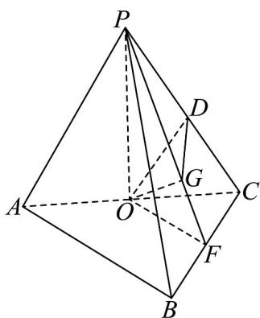
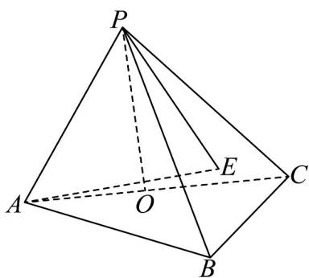
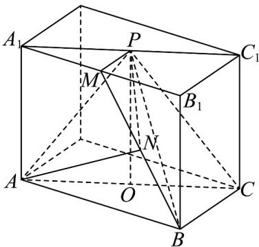
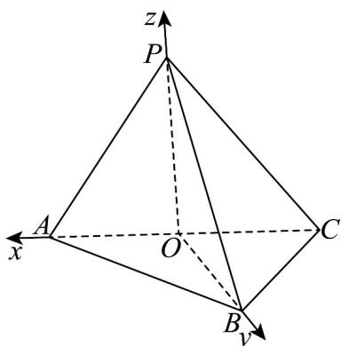

> [!faq]- 《专题1_4_空间向量的应用_高效培优讲义_》官方解析
>
> > [!success]- **【答案】** $\frac{\sqrt{210}}{30}$
>
> > [!note]- **【分析】**
> > 解法一：将直线 PA 与平面 PBC 所成角转化为 OD 与平面 PBC 所成的角即可求解；解法二：设
> >
> > $\left|PA\right| = 2a$ ，由等体积法得出 $\left|AE\right| = \frac{\sqrt{14}}{\sqrt{15}} a$ ，由线面夹角定义即可求解；
> > 解法三：以平面 $ABC$ 为底面， $OP$ 为高，
> >
> > 将原几何体补成长方体，再由线面夹角定义即可求解；
> > 解法四：以 $O$ 为原点，分别以直线 $OA, OB, OP$ 为 $x$ 轴、
> >
> > y 轴、z 轴建立空间直角坐标系，用直线与平面夹角的向量公式求解即可.
>
> > [!note]- **【解析】**
> > 解法一：如图所示，设D是PC的中点，连接OD，
> >
> > 则 $OD \parallel PA$ ，故 $OD, PA$ 与平面 $PBC$ 所成的角相等，
> >
> > 设 F 为 BC 的中点，连接 OF，则 $OF \parallel AB$ ，
> >
> > 因为 $AB \perp BC$ ，所以 $OF \perp BC$ ，
> >
> > 因为 $OP \perp$ 平面 ABC ， $BC \subset$ 平面 ABC ，
> >
> > 所以 $OP \perp BC$ ，
> >
> > 又 $OF \perp BC$ ， $OP \perp BC$ ， $OF, OP \subset$ 平面 $OPF$ ，且 $OF \cap OP = O$
> >
> > 所以 $BC \perp$ 平面 $OPF$ ，又 $BC \subset$ 平面 $PBC$
> >
> > 所以平面 $PBC \perp$ 平面 OPF ，
> >
> > 因为平面 $PBC \cap$ 平面 OPF = AF ，
> >
> > 所以点 O 在平面 PBC 上的射影 $G \in PF$ ，
> >
> > 过点 O 作 $OG \perp PF$ 于点 G ，
> >
> > 因为 $OG \perp PF$ ，平面 $PBC \cap$ 平面 OPF = AF， $OG \subset$ 平面 OPF，
> >
> > 所以 $OG \perp$ 平面 $PBC$ ，则 $\angle ODG$ 即为 $OD$ 与平面 $PBC$ 所成的角。
> >
> > 设 $\left|PA\right|=4$ ，则 $\left|AB\right|=\left|BC\right|=2$ ，由此可得 $\left|AC\right|=2\sqrt{2}$ ， $\left|PO\right|=\sqrt{14}$ ，则 $\left|OD\right|=2$
> >
> > 由 $OP \perp$ 平面 ABC ， $OF \subset$ 平面 ABC ，所以 $OP \perp OF$
> >
> > 在 Rt△ POF 中， $\left|PF\right|=\sqrt{\left|OP\right|^{2}+\left|OF\right|^{2}}=\sqrt{14+1}=\sqrt{15}$
> >
> > 则由等面积法得， $\left|OG\right|=\frac{\left|OP\right|\cdot\left|OF\right|}{\left|PF\right|}=\frac{\sqrt{14}}{\sqrt{15}}$
> >
> > 故 $\sin \angle ODG = \frac{|OG|}{|OD|} = \frac{\sqrt{210}}{30}$ 即直线 $PA$ 与平面 $PBC$ 所成角的正弦值为 $\frac{\sqrt{210}}{30}$
> >
> > 
> >
> > 解法二：如图所示，过点A作 $AE \perp$ 平面PBC，垂足为E，连接PE
> >
> > 
> >
> > 则 $\angle APE$ 为 $AP$ 与平面 $PBC$ 所成的角.
> >
> > 设 $\left|AB\right|=\left|BC\right|=a$ ，则 $\left|PA\right|=2a$ ，则 $\left|AC\right|=\sqrt{2}a$
> >
> > $\left|AO\right| = \frac{\sqrt{2}}{2} a,\left|PO\right| = \frac{\sqrt{14}}{2} a,\left|PB\right| = 2a$
> >
> > 因为 $AB \perp BC$ ，所以 $S_{\triangle ABC} = \frac{1}{2} |AB| \cdot |BC| = \frac{1}{2} a^2$
> >
> > 由解法一得， $S_{\triangle PBC}=\frac{\sqrt{15}}{4}a^{2}$
> >
> > 由 $V_{P-ABC} = V_{A-PBC}$ 可得 $\frac{1}{3} S_{\triangle ABC} \cdot |PO| = \frac{1}{3} S_{PBC} \cdot |AE|$ ，代入数据得 $|AE| = \frac{\sqrt{14}}{\sqrt{15}} a$
> >
> > 故 $\sin \angle APE = \frac{|AE|}{|AP|} = \frac{\sqrt{210}}{30}$
> >
> > 解法三（补体法）：如图所示，以平面 $ABC$ 为底面， $OP$ 为高，将原几何体补成长方体（ $AC_{1}$ 为该长方体的
> >
> > 体对角线）.
> >
> > 设 M 是 $A_{1}B_{1}$ 的中点，则 $PM // B_{1}C_{1} // BC$ ，点 M 在平面 PBC 上，
> >
> > 又 $BC \perp$ 平面 $ABB_{1}A_{1}$ ， $BC \subset$ 平面 PBC，
> >
> > 所以平面 $PBC \perp$ 平面 $ABB_{1}A_{1}$
> >
> > 因为平面 $PBC \cap$ 平面 $ABB_{1}A_{1} = BM$
> >
> > 所以点 A 在平面 PBC 上的射影 N 必在 BM 上，
> >
> > 过点 A 作 $AN \perp BM$ 于点 N ，
> >
> > 因为 $AN \perp BM$ ， $AN \subset$ 平面 $ABB_{1}A_{1}$ ，
> >
> > 所以 $AN \perp$ 平面 PBC ，
> >
> > 因此 $\angle APN$ 即为 $PA$ 与平面 $PBC$ 所成的角，
> >
> > 设 $\left|AB\right|=\left|BC\right|=2,\left|AP\right|=4$ ，则 $\left|PO\right|=\sqrt{14},\left|BM\right|=\sqrt{15}$ ， $\left|AN\right|=\frac{\left|AB\right|\cdot\left|AA_{1}\right|}{\left|BM\right|}=\frac{2\sqrt{14}}{\sqrt{15}}$
> >
> > 在 Rt△APN 中， $\sin\angle APN=\frac{|AN|}{|AP|}=\frac{\sqrt{210}}{30}$
> >
> > 
> >
> > 解法四（向量法）：因为 $OP \perp$ 底面 $ABC$ ， $OA, OB \subset$ 底面 $ABC$
> >
> > 所以 $OP \perp OA, OP \perp OB$
> >
> > 又因为 $\left|AB\right|=\left|BC\right|$ ，O 是 AC 的中点，所以 $OA \perp OB$ ，
> >
> > 如图所示，以 O 为原点，分别以直线 OA, OB, OP 为 x 轴、y 轴、z 轴，
> >
> > 建立空间直角坐标系，
> >
> > 
> >
> > 设 $\left|PA\right|=4$ ，则 $\left|AB\right|=\left|BC\right|=2$ ， $\left|AC\right|=2\sqrt{2}$ ， $\left|PO\right|=\sqrt{14}$
> >
> > $$
> > \text {可得} A \left(\sqrt {2}, 0, 0\right), B \left(0, \sqrt {2}, 0\right), C \left(- \sqrt {2}, 0, 0\right), P \left(0, 0, \sqrt {1 4}\right)
> > $$
> >
> > 则 $\stackrel{\mathrm{uu}}{PA} = (\sqrt{2}, 0, -\sqrt{14})$ ， $\stackrel{\mathrm{uu}}{PB} = (0, \sqrt{2}, -\sqrt{14})$ ， $\stackrel{\mathrm{uu}}{PC} = (-\sqrt{2}, 0, -\sqrt{14})$
> >
> > 设平面 PBC 的一个法向量为 $n = (x, y, z)$ ,
> >
> > 则由 $\left\{\begin{aligned}n\cdot PB&=0\\ \rightarrow &\square \\ n\cdot PC&=0\end{aligned}\right.$ ，得 $\left\{\begin{aligned}\sqrt{2}y-\sqrt{14}z&=0\\ -\sqrt{2}x-\sqrt{14}z&=0\end{aligned}\right.$ ，取 $z=1$ ，得 $n=\left(-\sqrt{7},\sqrt{7},1\right)$ ，
> >
> > 设直线 $_{PA}$ 与平面 $_{PBC}$ 所成的角为 $_{\theta}$ ，则 $\sin\theta=\frac{\left|\vec{n}\cdot\overrightarrow{PA}\right|}{\left|n\right|\cdot\left|PA\right|}=\frac{\left|- \sqrt{14}-\sqrt{14}\right|}{\sqrt{15}\times\sqrt{16}}=\frac{\sqrt{210}}{30}$ 。
