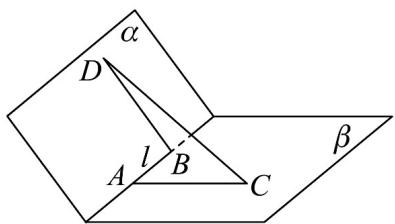
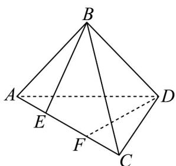

> [!faq]- 《专题1_4_空间向量的应用_高效培优讲义_》官方解析
>
> > [!success]- **【答案】** $\frac{\pi}{6}$
>
> > [!note]- **【分析】**
> > 根据给定条件，利用线面角的向量法求解·
>
> > [!note]- **【解析】**
> > 设直线 l 与平面 $\alpha$ 所成角为 $\theta$ ，依题意， $\sin\theta=|\cos\langle a,n\rangle|=\frac{|a:n|}{|a||n|}=\frac{2}{4\times1}=\frac{1}{2}$
> >
> > 所以 $\theta=\frac{\pi}{6}$ .
> >
> > 故答案为： $\frac{\pi}{6}$
> >
> > 题型06 二面角
> >
> > 【典例1】如图，二面角 $\alpha - l - \beta$ 的大小为 $\frac{2\pi}{3}, A, B$ 是棱 $l$ 上两点， $AC \perp l, BD \perp l$ ，且 $AB = 3$ ， $AC = 2, BD = 5$ ，则 $CD =$ \_\_\_\_.
> >
> > 
> >
> > 【答案】 $4 \sqrt{3}$
> >
> > 【分析】依题意，可得 $< \overline{AC},\overline{BD} > = \frac{2\pi}{3}$ ， $\overline{CA}\cdot \overline{AB} = 0,\overline{BD}\cdot \overline{AB} = 0$ ，及 $\overline{CD} = \overline{CA} +\overline{AB} +\overline{BD}$ ，再由空间向量的
> >
> > 数量积公式与模长计算公式，代入求解即可·
> >
> > 【详解】由二面角的平面角的定义知 $<\frac{1}{3}AC, BD>=\frac{2\pi}{3}$
> >
> > 所以 $AC \cdot BD = \left|AC\right|\left|BD\right|\cos\left\langle AC, BD\right\rangle = 2 \times 5 \times \cos\frac{2\pi}{3} = -5$
> >
> > 由 $AC \perp l, BD \perp l$ ，得 $CA \cdot AB = 0, BD \cdot AB = 0$ .
> >
> > 因为 $CD = CA + AB + BD$
> >
> > 所以 $\left| \overline{CD} \right|^2 = \left( \overline{CA} + \overline{AB} + \overline{BD} \right)^2 = \overline{CA}^2 + \overline{AB}^2 + \overline{BD}^2 + 2CA \cdot AB + 2CA \cdot BD + 2AB \cdot BD$
> >
> > $$
> > = 2 ^ {2} + 3 ^ {2} + 5 ^ {2} + 2 \times 0 + 2 \times 5 + 2 \times 0 = 4 8
> > $$
> >
> > 所以 $CD = \left| CD \right| = 4\sqrt{3}$ .
> >
> > 故答案为： $4\sqrt{3}$
> >
> > 【典例2】在矩形ABCD中， $AB = 2$ ， $AD = 2\sqrt{3}$ ，沿对角线AC将矩形折成一个大小为 $\theta$ 的二面角 $B - AC - D$
> >
> > 若 $\cos \theta = \frac{1}{3}$ ，则此时点 $B$ 与点 $D$ 之间的距离是 \_\_\_\_。
> >
> > 【答案】 $2 \sqrt{2}$
> >
> > 【分析】根据二面角、空间向量运算等知识来求得点 B 与点 D 之间的距离.
> >
> > 【详解】分别作 $BE \perp AC$ ， $DF \perp AC$ ，垂足为 $E$ ， $F$ ，则 $\theta = <EB, FD>$
> >
> > 由已知可得， $EB = FD = \sqrt{3}$ ， $AE = CF = 1$ ， $EF = 2$ 。因为 $\overline{BD} = \overline{BE} +\overline{EF} +\overline{FD}$
> >
> > 则 $|\overline{BD}|^2 = \overline{BD}^2 = (BE + EF + FD)^2 = \overline{BE}^2 + \overline{EF}^2 + \overline{FD}^2 + 2BE \cdot FD = 3 + 4 + 3 + 2\sqrt{3} \cdot \sqrt{3} \cos(\pi - \theta) = 8$ ，所以
> >
> > $$
> > \left| \stackrel {\sqcup \sqcup \sqcup} {B D} \right| = 2 \sqrt {2}
> > $$
> >
> > 故答案为： $2 \sqrt{2}$
> >
> > 
> >
> > ## 方法技巧
> >
> > 如图，若 $PA \perp \alpha$ 于 $A, PB \perp \beta$ 于 $B$ ，平面 $PAB$ 交 $l$ 于 $E$ ，则 $\angle AEB$ 为二面角 $\alpha - l - \beta$ 的平面角， $\angle AEB + \angle APB = 180^{\circ}$
> >
> > 
> >
> > 若 $n_1, n_2$ 分别为面 $\alpha, \beta$ 的法向量， $\cos \left\langle n_1, n_2 \right\rangle = \frac{n_1 \cdot n_2}{|n_1| \cdot |n_2|}$ 则二面角的平面角 $\angle AEB = \left\langle n_1, n_2 \right\rangle$ 或 $\pi - \left\langle n_1, n_2 \right\rangle$
