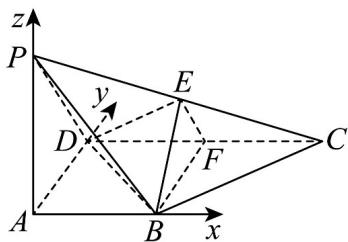

> [!faq]- 《专题1_4_空间向量的应用_高效培优讲义_》官方解析
>
> > [!success]- **【答案】** $\left(\frac{2\sqrt{15}}{15},+\infty\right)$
>
> > [!note]- **【分析】**
> > 建立如图所示空间直角坐标系，设 $AB = 1$ ，向量法表示出二面角 $E - BD - C$ 的平面角的余弦值，结
> >
> > 合题意建立关于 $k$ 的不等式，解之即可得到实数 $k$ 的取值范围。
>
> > [!note]- **【解析】**
> > 以 A 为原点，以 AB, AD, AP 为 x 轴、y 轴、z 轴，建立空间直角坐标系如图所示，
> >
> > 
> >
> > 设 $AB = 1$ ，则 $A(0,0,0),B(1,0,0),C(2,2,0),D(0,2,0),P(0,0,k),E\left(1,1,\frac{k}{2}\right)$
> >
> > $\overline{BD} = (-1,2,0)$ ， $\overline{BE} = \left(0,1,\frac{k}{2}\right)$ ，且平面CDB的一个法向量为 $m = (0,0,1)$
> >
> > 设平面 EDB 的一个法向量为 $n = (x, y, z)$
> >
> > 则 $\left\{ \begin{array}{l} n \cdot BD = -x + 2y = 0 \\ \rightarrow \square \square \square \\ n \cdot BE = y + \frac{1}{2} kz = 0 \end{array} \right.$ ，取 $y = 1$ ，有 $x = 2, z = -\frac{2}{k}$ ，可得 $\vec{n} = \left(2, 1, -\frac{2}{k}\right)$
> >
> > 设二面角 的大小为 ，则 $\cos\theta=\left|\cos m,n\right|=\frac{\frac{2}{k}}{\sqrt{4+1+\frac{4}{k^{2}}}}<\frac{\sqrt{3}}{2}$
> >
> > 化简得 $k^{2} > \frac{4}{15}$ ，所以 $k > \frac{2\sqrt{15}}{15}$
> >
> > 所以实数 k 的取值范围 $\left(\frac{2\sqrt{15}}{15}, +\infty\right)$ .
> >
> > 故答案为： $\left(\frac{2\sqrt{15}}{15},+\infty\right)$
