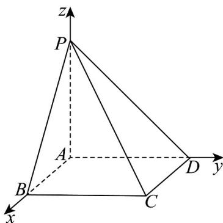

> [!faq]- 《专题1_4_空间向量的应用_高效培优讲义_》官方解析
>
> > [!success]- **【答案】** $^{1}$
>
> > [!note]- **【分析】**
> > 根据给定条件，建立空间直角坐标系，求出平面PBC和平面PCD的法向量坐标，再利用面面角的向
> >
> > 量求法列式计算即得·
>
> > [!note]- **【解析】**
> > 四棱锥 P-ABCD 的底面 ABCD 是正方形， $PA \perp$ 底面 ABCD，
> >
> > 建立如图所示的空间直角坐标系 $Axyz$ ，设 $AB = AD = 1, PA = a > 0$
> >
> > 则 $P(0,0,a),B(1,0,0),C(1,1,0),D(0,1,0)$ ， $\overline{PB} = (1,0, - a),\overline{PC} = (1,1, - a),\overline{PD} = (0,1, - a)$
> >
> > 设平面 PBC 和平面 PCD 的法向量分别为 $n = (x_{1}, y_{1}, z_{1})$ , $m = (x_{2}, y_{2}, z_{2})$ ,
> >
> > 则 $\left\{ \begin{array}{l} n \cdot PB = x_1 - az_1 = 0 \\ \rightarrow \square \square \\ n \cdot PC = x_1 + y_1 - az_1 = 0 \end{array} \right.$ ，令 $z_1 = 1$ ，得 $n = (a,0,1)$
> >
> > $\left\{ \begin{array}{l}m\cdot \square D = y_{2} - az_{2} = 0\\ \rightarrow \square \square \\ m\cdot PC = x_{2} + y_{2} - az_{2} = 0 \end{array} \right.$ ，令 $z_{2} = 1$ ，得 $\square m = (0,a,1)$
> >
> > 依题意 $\left|\cos\left\langle n,m\right\rangle\right|=\frac{\left|\boldsymbol{n}\cdot\boldsymbol{m}\right|}{\left|\boldsymbol{n}\right|\left|\boldsymbol{m}\right|}=\frac{1}{a^{2}+1}=\frac{1}{2}$ ，解得 a=1，所以 $\frac{PA}{AB}=1$ 。
> >
> > 故答案为：1
> >
> > 
