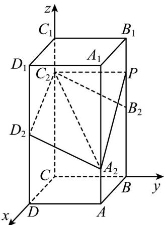
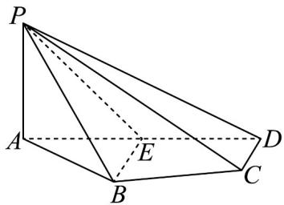
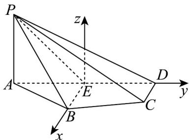
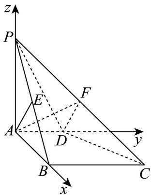
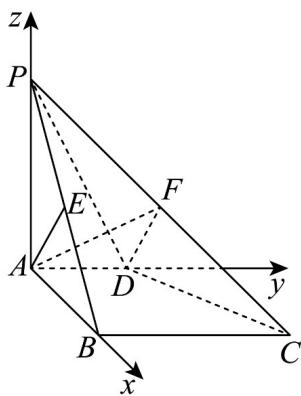

> [!faq]- 《专题1_4_空间向量的应用_高效培优讲义_》官方解析
>
> > [!success]- **【答案】** 1
>
> > [!note]- **【分析】**
> > 以 C 为坐标原点建立空间直角坐标系，求得平面 $PA_{2}C_{2}$ 和平面 $A_{2}C_{2}D_{2}$ 的法向量的坐标表示，再由二
> >
> > 面角 $P-A_{2}C_{2}-D_{2}$ 为 $150^{\circ}$ 即可得 $P(0,2,1)$ 或 $P(0,2,3)$ ，可求出 $B_{2}P=1$ .
>
> > [!note]- **【解析】**
> > 以 C 为坐标原点， $CD, CB, CC_{1}$ 所在直线为 x, y, z 轴建立空间直角坐标系，如下图所示：
> >
> > 
> >
> > 则 $C(0,0,0), C_2(0,0,3), B_2(0,2,2), D_2(2,0,2), A_2(2,2,1)$
> >
> > 设 $P(0,2,\lambda)(0\leq \lambda \leq 4)$ ，则 $\overline{A_2C_2} = (-2, - 2,2),\overline{PC_2} = (0, - 2,3 - \lambda),\overline{D_2C_2} = (-2,0,1)$
> >
> > 设平面 $PA_{2}C_{2}$ 的法向量 $n = (x,y,z)$ ，则 $\left\{ \begin{array}{l} n \cdot A_2C_2 = -2x - 2y + 2z = 0 \\ n \cdot PC_2 = -2y + (3 - \lambda)z = 0 \end{array} \right.$ ，
> >
> > 令 z=2 ，得 $y=3-\lambda, x=\lambda-1$ ，所以可得 $n=(\lambda-1,3-\lambda,2)$
> >
> > 设平面 $A_{2}C_{2}D_{2}$ 的法向量 $\stackrel{\square}{m} = (a,b,c)$ ，则 $\left\{ \begin{array}{l} m \cdot A, C_{2} = -2a - 2b + 2c = 0 \\ m \cdot D_{2}C_{2} = -2a + c = 0 \end{array} \right.$ ，
> >
> > 令 a=1 ，得 b=1,c=2 ，即 $m=(1,1,2)$
> >
> > 因此 $\left|\cos \left\langle \vec{n},m\right\rangle \right| = \frac{\left|n\cdot\vec{m}\right|}{\left|n\right|\left|m\right|} = \frac{6}{\sqrt{6}\sqrt{4 + (\lambda - 1)^2 + (3 - \lambda)^2}} = \left|\cos 150^\circ \right| = \frac{\sqrt{3}}{2}$
> >
> > 化简可得 $\lambda^{2}-4\lambda+3=0$ ，解得 $\lambda=1$ 或 $\lambda=3$ ，
> >
> > 即 $P(0,2,1)$ 或 $P(0,2,3)$
> >
> > 可得 $B_{2}P=1$ .
> >
> > 故答案为：1
> >
> > 题型07 距离问题
> >
> > 【典例1】如图，在四棱锥 $P - ABCD$ 中，平面 $PAD \perp$ 平面 $ABCD$ ， $E$ 为 $AD$ 的中点， $PA \perp AD$ ， $BE // CD$
> >
> > $BE\perp AD$ $PA = AE = BE = 2$ $CD = 1$
> >
> > 
> >
> > (1)求点A到平面PBC的距离；
> >
> > (2)在线段 $PE$ 上是否存在点 $M$ ，使得 $DM \parallel$ 平面 $PBC$ ? 若存在，求出点 $M$ 的位置；若不存在，说明理由。
> >
> > 【答案】(1) $\frac{3\sqrt{14}}{7}$
> >
> > (2)存在，点 $M$ 是 $PE$ 中点
> >
> > 【分析】（ $^{1}$ ）建立空间直角坐标系，利用坐标法可求得点到平面的距离；
> >
> > (2) 利用坐标法设点，根据线面平行列方程，解方程即可·
> >
> > 【详解】（1）因为平面 $PAD \perp$ 平面 ABCD，平面 $PAD \cap$ 平面 ABCD = AD，
> >
> > 且 $BE \perp AD, BE \subset$ 平面ABCD，故 $BE \perp$ 平面PAD.
> >
> > 以 $E$ 为原点， $EB, ED$ 所在直线为 $x, y$ 轴，过点 $E$ 平行于 $PA$ 的直线为 $z$ 轴，建立空间直角坐标系 $E - xyz$
> >
> > 则 $E(0,0,0)$ ， $P(0, - 2,2)$ ， $A(0, - 2,0)$ ， $B(2,0,0)$ ， $C(1,2,0)$ ， $D(0,2,0)$
> >
> > $$
> > \stackrel {{\text {UUU}}} {{P B}} = (2, 2, - 2) \quad \stackrel {{\text {UUU}}} {{B C}} = (- 1, 2, 0) \quad \stackrel {{\text {UUU}}} {{P E}} = (0, 2, - 2) \quad \stackrel {{\text {UUU}}} {{A P}} = (0, 0, 2)
> > $$
> >
> > 设平面 PBC 的法向量为 $n = (x, y, z)$
> >
> > 则 $\left\{ \begin{array}{l} n \cdot PB = 0 \\ \rightarrow \square \square \\ n \cdot BC = 0 \end{array} \right.$ ，即 $\left\{ \begin{array}{l} 2x + 2y - 2z = 0 \\ -x + 2y = 0 \end{array} \right.$ ，
> >
> > 令 $y = 1$ ，得平面PBC的一个法向量为 $n = (2,1,3)$
> >
> > 所以点 $\mathrm{A}$ 到平面 $PBC$ 的距离为 $d = \frac{\left|AP\cdot n\right|}{\left|n\right|} = \frac{6}{\sqrt{14}} = \frac{3\sqrt{14}}{7}$
> >
> > (2) 由 (1) 知，平面 $PBC$ 的一个法向量为 $n = (2, 1, 3)$
> >
> > “线段 $PE$ 上存在点 $E$ ，使得 $DM \parallel$ 平面 $PBC$ ”等价于“ $DM \cdot n = 0$ ”.
> >
> > 因为 $\overline{PE} = (0,2, - 2)$ ，设 $\overline{PM} = \lambda \overline{PE} = (0,2\lambda , - 2\lambda)$ ， $\lambda \in [0,1]$
> >
> > 则 $M(0,2\lambda - 2,2 - 2\lambda)$ ， $DM = (0,2\lambda - 4,2 - 2\lambda)$
> >
> > 所以 $DM \cdot n = 2\lambda - 4 + 6 - 6\lambda = 0$ ，解得 $\lambda = \frac{1}{2}$ ，
> >
> > 所以线段 $PE$ 上存在点 $M$ ，即 $PE$ 中点，使得 $DM \parallel$ 平面 $PBC$ .
> >
> > 
> >
> > 【典例2】如图，在四棱锥 $P - ABCD$ 中， $PA \perp$ 平面 $ABCD, PA = AB, AD // BC, AD \perp AB, E$ 是棱
> >
> > $PB$ 的中点， $AB = BC = 2AD = 2$
> >
> > 
> >
> > (1)证明： $AE\perp$ 平面PBC.
> >
> > (2)求点 E 到平面 PCD 的距离.
> >
> > (3)若点 $F$ 在棱 $PC$ 上，求平面 $ADF$ 与平面 $PCD$ 所夹锐角的余弦值的最小值·
> >
> > 【答案】(1)证明见解析(2) $\frac{\sqrt{6}}{3}$ (3) $\frac{\sqrt{6}}{6}$
> >
> > 【分析】（1）应用线面垂直得出 $PA \perp BC$ 结合已知应用线面垂直判定定理得出 $BC \perp$ 平面PAB，再应用线面
> >
> > 垂直证明即可；
> >
> > (2) 建立空间直角坐标系，先求出平面 PCD 的法向量，再根据点到平面距离公式计算求解；
> >
> > （3）应用空间向量法求出平面 $ADF$ 与平面 $PCD$ 的法向量，再应用面面角余弦公式计算再结合二次函数值域
> >
> > 计算求解·
> >
> > 【详解】（1）因为 $PA \perp$ 平面ABCD，且 $BC \subset$ 平面ABCD，所以 $PA \perp BC$
> >
> > 因为 $AD \parallel BC$ ，且 $AD \perp AB$ ，所以 $BC \perp AB$
> >
> > 且 $PA \cap AB = A$ ，PA, $AB \subset$ 平面 PAB，
> >
> > 所以 $BC \perp$ 平面 $PAB$ ，
> >
> > 因为 $AE \subset$ 平面 PAB ，所以 $BC \perp AE$
> >
> > 因为 PA = AB ， E 是棱 PB 的中点，所以 $AE \perp PB$ ，
> >
> > 因为 $PB$ ， $BC\subset$ 平面 $PBC$ ，且 $PB\cap BC = B$ ，所以 $AE\bot$ 平面 $PBC$
> >
> > (2) 以 A 为坐标原点，分别以 $AB, AD, AP$ 的方向为 $x$ ， $y$ ， $z$ 轴的正方向建立如图所示的空间直角坐标系。
> >
> > 
> >
> > 因为 $AD = 1$ ，所以 $A(0,0,0)$ ， $C(2,2,0)$ ， $D(0,1,0)$ ， $P(0,0,2)$ ， $B(2,0,0)$
> >
> > 则 $AD = (0,1,0), PC = (2,2,-2), PD = (0,1,-2)$
> >
> > 因为点 E 在棱 PB 中点上，所以 E 的坐标为 $(1,0,1)$ ， $ED = (-1,1,-1)$
> >
> > 设平面 PCD 的法向量为 $n = (x, y, z)$ ,
> >
> > 则 $\left\{\begin{aligned}&n\cdot P C=0\\ &n\cdot P D=0\end{aligned}\right.\Rightarrow\left\{\begin{aligned}&2x+2y-2z=0\\ &y-2z=0\end{aligned}\right.$ ，令 y=2，得 $n=(-1,2,1)$ ，
> >
> > $$
> > \therefore d = \frac {\left| \overrightarrow {E D} \cdot n \right|}{\left| n \right|} = \frac {2}{\sqrt {6}} = \frac {\sqrt {6}}{3}
> > $$
> >
> > (3) 以 A 为坐标原点，分别以 $AB, AD, AP$ 的方向为 $x$ ， $y$ ， $z$ 轴的正方向建立如图所示的空间直角坐标系。
> >
> > 
> >
> > 因为 $AD = 1$ ，所以 $A(0,0,0),C(2,2,0),D(0,1,0),P(0,0,2)$
> >
> > 则 $AD = (0,1,0), PC = (2,2,-2), PD = (0,1,-2)$
> >
> > 因为点 $F$ 在棱 $PC$ 上，所以 $\overline{PF} = \lambda \overline{PC} = (2\lambda, 2\lambda, -2\lambda)$
> >
> > 则 $F(2\lambda, 2\lambda, -2\lambda + 2)$ ，故 $AF = (2\lambda, 2\lambda, -2\lambda + 2)$
> >
> > 设平面 $ADF$ 的法向量为 $m = (x_0, y_0, z_0)$
> >
> > 则 $\left\{ \begin{array}{l}m\cdot AD = y_0 = 0\\ \rightarrow \square \square \\ m\cdot AF = 2\lambda x_0 + 2\lambda y_0 + (-2\lambda +2)z_0 = 0 \end{array} \right.$
> >
> > 令 $x_0 = \lambda - 1$ ，得 $m = (\lambda - 1, 0. \lambda)$
> >
> > 由（2）知平面 $PCD$ 的一个法向量 $n = (-1,2,1)$
> >
> > 设平面 $ADF$ 与平面 $PCD$ 的夹角为 $\theta$
> >
> > 则 $\cos \theta = |\cos \langle \overrightarrow{m,n}\rangle| = \frac{1}{\sqrt{12\left[\left(\lambda - \frac{1}{2}\right)^2 + \frac{1}{4}\right]}}$
> >
> > 因为 $0 \leq \lambda \leq 1$ ，所以 $\sqrt{3} \leq \sqrt{12\left[\left(\lambda - \frac{1}{2}\right)^2 + \frac{1}{4}\right]} \leq \sqrt{6}$
> >
> > 所以 $\frac{\sqrt{6}}{6} \leq \frac{1}{\sqrt{12\left[\left(\lambda - \frac{1}{2}\right)^2 + \frac{1}{4}\right]}} \leq \frac{\sqrt{3}}{3}$
> >
> > 即 $\frac{\sqrt{6}}{6} \leq \cos \theta \leq \frac{\sqrt{3}}{3}$
> >
> > 故平面 $ADF$ 与平面 $PCD$ 夹角的余弦值的最小值为 $\frac{\sqrt{6}}{6}$
> >
> > ## 方法技巧
> >
> > 1. 求点面距的一般步骤：
> > - **①**：求出该平面的一个法向量；
> > - **②**：找出从该点出发的平面的任一条斜线段对应的向量；
> > - **③**：求出法向量与斜线段向量的数量积的绝对值再除以法向量的模，即可求出点到平面的距离。
> >
> > 即：点 A 到平面 $\alpha$ 的距离 $d = \frac{\left|AB \cdot n\right|}{\left|n\right|}$ ，其中 $B \in \alpha$ ，n 是平面 $\alpha$ 的法向量。
> >
> > 2. 设直线 $l$ 的单位方向向量为 $u$ ， $A \in l$ ， $P \notin l$ ，设 $AP = a$ ，则点 $P$ 到直线 $l$ 的距离 $d = \sqrt{|a|^2 - (a \cdot u)^2}$
