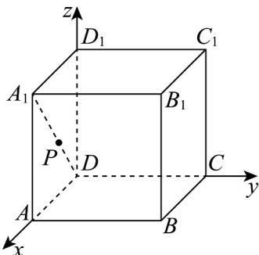
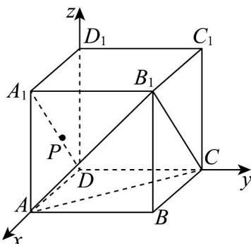
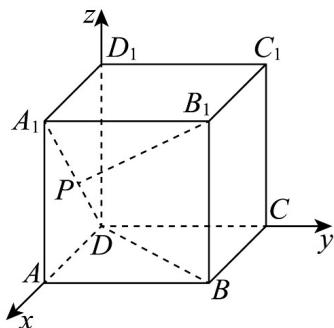
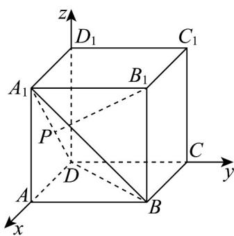

> [!faq]- 《专题1_4_空间向量的应用_高效培优讲义_》官方解析
>
> > [!success]- **【答案】** ACD
>
> > [!note]- **【分析】**
> > 建立空间直角坐标系，设 $P(a,0,a)$ ，且 $a\in[0,1]$ ，利用空间两点间的距离通过求函数最大值即可判
> >
> > 断 $^{A}$ ；由 $A_{1}D$ ||平面 $A_{1}B_{1}C$ 得到点 P 到平面 $AB_{1}C$ 的距离即为点 $A_{1}$ 到平面 $AB_{1}C$ 的距离，并通过等体积法求得距离
> >
> > 可判断 $^{B}$ ；利用空间向量表示线线角、线面角并利用函数单调性求得最值或范围，从而判断 CD.
>
> > [!note]- **【解析】**
> > 如图，以 D 为坐标原点，以 DA, DC, DD₁ 所在的直线分别为轴建立空间直角坐标系，则
> >
> > $$
> > D (0, 0, 0), A (1, 0, 0), B (1, 1, 0), C (0, 1, 0), D _ {1} (0, 0, 1), A _ {1} (1, 0, 1), B _ {1} (1, 1, 1), C _ {1} (0, 1, 1).
> > $$
> >
> > 
> >
> > 设 $P(a,0,a)$ ，且 $a\in[0,1]$ .
> >
> > 对于A， $B_{1}P = \sqrt{(a - 1)^{2} + (0 - 1)^{2} + (a - 1)^{2}} = \sqrt{2(a - 1)^{2} + 1}$
> >
> > 当 $a = 0$ 时， $B_{1}P_{\max} = \sqrt{3}$ 故 $\mathsf{A}$ 正确；
> >
> > 对于 B，正方体 $ABCD - A_{1}B_{1}C_{1}D_{1}$ 中， $A_{1}D \parallel B_{1}C$ ， $B_{1}C \subset$ 平面 $A_{1}B_{1}C$ ， $A_{1}D \not\subset$ 平面 $A_{1}B_{1}C$ ，
> >
> > 所以 $A_{1}D \parallel$ 平面 $A_{1}B_{1}C$ ，因为 $P \in A_{1}D$ ，所以点 P 到平面 $AB_{1}C$ 的距离是等于点 $A_{1}$ 到平面 $AB_{1}C$ 的距离，
> >
> > 设 $A_{1}$ 到平面 $AB_{1}C$ 的距离为 $h$ ，由 $V_{A_1 - AB_1C} = V_{C - A_1BB_1}$ 得， $\frac{1}{3}\times \frac{\sqrt{3}}{4}\times \left(\sqrt{2}\right)^2 h = \frac{1}{3}\times \frac{1}{2}\times 1^3$ ，得 $h = \frac{\sqrt{3}}{3}$ ，故B不正确；
> >
> > 
> >
> > 设 $P(a,0,a)$ ，且 $a\in [0,1]$
> >
> > 对于 $\mathbb{C}$ ， $B_{1}P = (a - 1, - 1,a - 1)$ ， $BD = (-1, - 1,0)$
> >
> > 设直线 $B_{1}P$ 与 $BD$ 的所成角为 $\theta$ ， $\theta \in [0,\pi ]$
> >
> > 则 $\cos\theta=\frac{\left|\begin{matrix}B_{1}P\cdot BD\\ B_{1}P\end{matrix}\right|}{\left|\begin{matrix}B_{1}P\end{matrix}\right|\left|\begin{matrix}BD\end{matrix}\right|}=\frac{2-a}{\sqrt{2}\sqrt{2(a-1)^{2}+1}}$
> >
> > 令 $t = \frac{1}{2 - a}$ ，则 $t\in \left[\frac{1}{2},1\right]$
> >
> > $$
> > \cos \theta = \frac {\frac {1}{t}}{\sqrt {2} \sqrt {2 \left(1 - \frac {1}{t}\right) ^ {2} + 1}} = \frac {\frac {1}{t}}{\sqrt {2} \sqrt {\frac {2}{t ^ {2}} - \frac {4}{t} + 3}} = \frac {1}{\sqrt {2} \sqrt {3 t ^ {2} - 4 t + 2}}
> > $$
> >
> > 函数 $f(t) = 3t^2 - 4t + 2$ ， $t \in \left[\frac{1}{2}, 1\right]$ 在 $t \in \left[\frac{1}{2}, \frac{2}{3}\right]$ 上单调递减，在 $t \in \left[\frac{2}{3}, 1\right]$ 上单调递增，所以
> >
> > $$
> > f (t) _ {\min} = g \left(\frac {2}{3}\right) = 3 \times \left(\frac {2}{3}\right) ^ {2} - 4 \times \left(\frac {2}{3}\right) + 2 = \frac {4}{3} - \frac {8}{3} + 2 = \frac {2}{3}
> > $$
> >
> > $\left(\cos \theta\right)_{\max} = \frac{\sqrt{3}}{2}$ ，所以 $\theta_{\min} = \frac{\pi}{6}$ ，故 $^C$ 正确；
> >
> > 
> >
> > 对于 $^{D}$ ，设平面 $A_{1}BD$ 的法向量 $n=(x,y,z)$ ，则 $\left\{\begin{aligned}&n\cdot DB=x+y=0\\&n\cdot DA_{1}=x+z=0\end{aligned}\right.$
> >
> > 取 $x = 1$ ，得 $n = (1, - 1, - 1)$
> >
> > $$
> > B _ {1} P = (a - 1, - 1, a - 1)
> > $$
> >
> > 所以直线 $B_{1}P$ 与平面 $A_{1}BD$ 所成角的正弦值为： $\frac{\left|\overrightarrow{B_1P}\cdot n\right|}{\left|\overrightarrow{B_1P}\right|\left|n\right|} = \frac{1}{\sqrt{3}\sqrt{2(a - 1)^2 + 1}}$
> >
> > 因为 $g(a) = \frac{1}{\sqrt{3}\sqrt{2(a - 1)^2 + 1}}$ 在 $a\in [0,1]$ 上单调递增
> >
> > $\frac{\left|\begin{matrix}B_{1}P\cdot n\\ \square\square\square\end{matrix}\right|}{\left|\begin{matrix}B_{1}P\left|\left|n\right|\end{matrix}\right|}\rightarrow=\frac{1}{\sqrt{3}\sqrt{2(a-1)^{2}+1}}\in\left[\frac{1}{3},\frac{\sqrt{3}}{3}\right]$ ，故 $^{D}$ 正确
> >
> > 故选：ACD
> >
> > 
