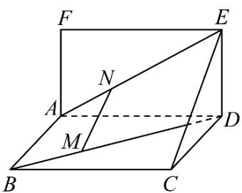

<!-- question-source:start -->
【变式1】如图所示，已知矩形ABCD和矩形ADEF所在的平面互相垂直，点 $M$ ， $N$ 分别在对角线BD，AE

上，且 $BM = \frac{1}{3} BD$ ， $AN = \frac{1}{3} AE$ 用向量方法证明：MN//平面CDE.

<!-- question-source:end -->

![[高中/课堂同步/题库/人教A版高中数学同步讲义(2026)/03_选择性必修第一册/第一章 空间向量与立体几何/讲义/专题1_4_空间向量的应用_高效培优讲义_/题型_02_利用向量研究平行问题_sec_12/questions/answers/Q00062857A1.md]]
