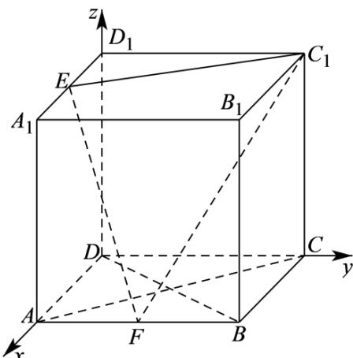

> [!faq]- 《专题1_4_空间向量的应用_高效培优讲义_》官方解析
>
> > [!success]- **【答案】** AC
>
> > [!note]- **【分析】**
> > 利用异面直线的定义可判断 $^{A}$ 选项；建立空间直角坐标系，利用空间向量法可判断 $^{BCD}$ 选项.
>
> > [!note]- **【解析】**
> > 以点D为坐标原点，DA、DC、 $DD_{1}$ 所在直线分别为x、y、z轴建立如下图所示的空间直角坐标
> >
> > 系，
> >
> > 
> >
> > 不妨设正方体的棱长为 $2$ ，则 $A(2,0,0)$ 、 $B(2,2,0)$ 、 $C(0,2,0)$ 、 $D(0,0,0)$ 、 $E(1,0,2)$ 、 $F(2,1,0)$ 、 $C_1(0,2,2)$ ，
> >
> > 对于 A 选项，EF、BC 既不平行，也不相交，故 EF 与 BC 异面，A 对；
> >
> > 对于 B 选项， $EF = (1,1,-2)$ ，易知平面 $CDD_{1}C_{1}$ 的一个法向量为 $m = (1,0,0)$
> >
> > 则 $EF \cdot m = 1 \neq 0$ ，故 $EF$ 与平面 $CDD_{1}C_{1}$ 不平行，B 错；
> >
> > 对于 C 选项， $AC = (-2, 2, 0)$ ，所以， $EF \cdot AC = -2 + 2 = 0$ ，故 $EF \perp AC$ ，C 对；
> >
> > 对于 D 选项， $\overline{DB}=(2,2,0)$ ，所以， $EF\cdot\overline{DB}=2+2=4$ ，所以，EF、BD 不垂直，
> >
> > 故 BD 与平面 $EFC_{1}$ 不垂直，D 错.
> >
> > 故选 **AC**.
