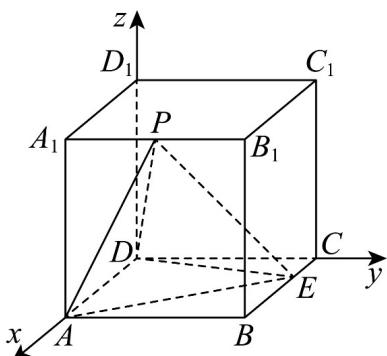

## 题型 03 利用向量研究垂直问题

【典例1】如图，已知在长方体 $ABCD - A_{1}B_{1}C_{1}D_{1}$ 中， $AB = 3$ ， $AD = 4$ ， $AA_{1} = 5$ ，点 $E$ 为 $CC_{1}$ 上的一个动点，

平面 $BED_{1}$ 与棱 $AA_{1}$ 交于点 $F$ ，给出下列命题：

①四棱锥 $B_{1} - BED_{1}F$ 的体积为20；

②存在唯一的点 $E$ ，使截面四边形 $BED_{1}F$ 的周长取得最小值 $2\sqrt{74}$ ；

③当点 E 不与 C， $C_{1}$ 重合时，在棱 AD 上均存在点 G，使得 CG // 平面 $BED_{1}$ ；

④存在唯一的点 E，使得 $B_{1}D \perp$ 平面 $BED_{1}$ ，且 $CE = \frac{16}{5}$ .

其中正确的是\_\_\_\_（填写所有正确的序号）.

【答案】①②④

【分析】由给定条件可得 $B{ED}_{1}F$ 是平行四边形，求出三棱锥 ${B}_{1} - B{D}_{1}F$ 体积可判断①；求出 $\square B{ED}_{1}F$ 中

$BE + D_{1}E$ 的最小值可判断②；建立空间直角坐标系，借助空间向量计算可判断③，④即可作答·

【详解】平面 $BED_{1}$ 与棱 $AA_{1}$ 交于点 F，连接 $BF, D_{1}F$ ，如图，

在长方体 $ABCD - A_{1}B_{1}C_{1}D_{1}$ 中，平面 $ADD_{1}A_{1} //$ 平面 $BCC_{1}B_{1}$ ，平面 $ADD_{1}A_{1} \cap$ 平面 $BED_{1} = D_{1}F$ ，平面 $BCC_{1}B_{1} \cap$

平面 $BED_{1} = BE$

则有 $BE // D_1F$ ，同理 $BF // D_1E$ ，因此，四边形 $BED_{1}F$ 是平行四边形，

而 $D_{1}C_{1}\perp$ 平面 $BCC_{1}B_{1}$ ，所以四棱锥 $B_{1} - BED_{1}F$ 的体积 $V_{B_1 - BED_1F} = 2V_{B_1 - BED_1} = 2V_{D_1 - BEB_1} = 2\times \frac{1}{3}\times S_{\triangle BEB_1}\times D_1C_1$

$= \frac{2}{3} \times \frac{1}{2} \times 5 \times 4 \times 3 = 20$ ，①正确；

因截面四边形 $BED_{1}F$ 是平行四边形，则 $\square BED_{1}F$ 周长为 $2(BE + D_{1}E)$

把矩形 $BCC_{1}B_{1}$ 与矩形 $CDC_{1}D_{1}$ 展开在同一平面内，如图，连接 $BD_{1}$ 交 $CC_{1}$ 于 $E$ ，从而得 $BE + D_{1}E$ 的最小值为 $BD_{1} = \sqrt{BB_{1}^{2} + (B_{1}C_{1} + C_{1}D_{1})^{2}} = \sqrt{74}$ ，显然点 $E$ 唯一，所以存在唯一的点 $E$ ，使截面四边形 $BED_{1}F$ 的周长取得最小值 $2\sqrt{74}$ ，②正确；在长方体 $ABCD - A_{1}B_{1}C_{1}D_{1}$ 中，建立如图所示的空间直角坐标系，

则 $D(0,0,0),B(4,3,0),C(0,3,0),D_{1}(0,0,5),B_{1}(4,3,5)$ ，设点 $E(0,3,t)$ ， $\overline{BD}_1 = (-4, - 3,5)$ ， $\overline{BE} = (-4,0,t)$

令 $n = (x,y,z)$ 是平面 $BED_{1}$ 的一个法向量，则 $\left\{ \begin{array}{l} n \cdot BD_{1} = -4x - 3y + 5z = 0 \\ n \cdot BE = -4x + tz = 0 \end{array} \right.$ ，令 $x = t$ 得 $n = (t, \frac{20 - 4t}{3}, 4)$ ，设 $AD$ 上点 $G(\lambda, 0, 0)(0 \leq \lambda \leq 4)$ ，而 $0 < t < 5$ ， $CG = (\lambda, -3, 0)$ ，

当 $CG //$ 平面 $BED_{1}$ 时，有 $\overline{CG} \perp n$ ，即 $\overline{CG} \cdot n = t\lambda - (20 - 4t) = 0$ ， $\lambda = \frac{20}{t} - 4$ ，

由 $0 \leq \frac{20}{t} - 4 \leq 4$ 得 $\frac{5}{2} \leq t \leq 5$ ，则有 $\frac{5}{2} \leq t < 5$

即当点 E 在棱 $CC_{1}$ 中点到靠近点 $C_{1}$ 的线段（不含点 $C_{1}$ ）上移动时，在棱 AD 上均存在点 G，使得 CG // 平面 $BED_{1}$

当 $0 < t < \frac{5}{2}$ 时， $\lambda > 4$ ，此时点 $G$ 在线段 $AD$ 的延长线上，

即当点 E 在棱 $CC_{1}$ 中点到靠近点 C 的线段（不含两个端点）上移动时，在棱 AD 上不存在点 G，使得 CG // 平

面 $BED_{1}$ ，③不正确；

由③中信息知，要有 $B_{1}D \perp$ 平面 $BED_{1}$ ，必有 $DB_{1} // n$

而 $DB_{1} = (4,3,5)$ ，因此， $\frac{t}{4} = \frac{20 - 4t}{9} = \frac{4}{5}$ ，解得 $t = \frac{16}{5}$

所以存在唯一的点 E，使得 $B_{1}D \perp$ 平面 $BED_{1}$ ，且 $CE = \frac{16}{5}$ ，④正确·

故答案为：①②④

【典例2】如图，在正方体 $ABCD - A_{1}B_{1}C_{1}D_{1}$ 中， $E$ 为棱 $BC$ 上一点且 $BE = 2EC$ ，点 $P$ 是棱 $A_{1}B_{1}$ 上的动点，给

出下面4个结论：

①存在点 $P$ ，使 $PA \perp DE$ ；

②存在点 $P$ ，使 $PD = PE$ ；

③ $\triangle PDE$ 的面积不变；

④三棱锥 A-PDE 的体积不变.

则正确的结论的个数是（）

A. 1 B. 2 C. 3 D. 4

【答案】C

【分析】建立适当的空间直角坐标系，对于 $A$ ，只需验算 $AP \cdot DE = 0$ 是否成立，对于 $B$ ，只需验算 $\left|PD\right| = \left|PE\right|$

是否成立，对于 $C$ ， $\because DE$ 为定值，故只需判断点 $P$ 运动时到 $DE$ 距离 $d$ 是否是定值即可；对于 $D$ ，由 $P$ 到底面

距离 h 不变， $\triangle AED$ 面积 $S_{0}$ 不变即可判断.

【详解】不妨以D为原点， $\stackrel{\square\square}{DA}$ 、 $\stackrel{\square\square}{DC}$ 、 $\stackrel{\square\square}{DD}_{1}$ 分别为x、y、z轴正方向建立直角坐标系D-xyz，

设 $AD = 3$ ，则 $A(3,0,0)$ ， $D(0,0,0)$ ， $E(1,3,0)$ ，设 $P(3,y,3)$

结论 ①： $AP=\left(0,y,3\right)$ ， $DE=\left(1,3,0\right)$ ，令 $AP\cdot DE=0$ 得 $3y=0\Rightarrow y=0$ ，故当P与 $A_{1}$ 重合时， $PA\perp DE$ ，①

正确；

结论②： $PD = \sqrt{9 + y^2 + 9}$ ， $PE = \sqrt{4 + (y - 3)^2 + 9}$ ，令 $PD = PE\Rightarrow y = \frac{2}{3}$ ，故当 $P\left(3,\frac{2}{3},3\right)$ 时， $PD = PE$ ，②

正确；

结论 ③：∵ $A_{1}B_{1}$ 与 DE 不平行，故点 P 运动时到 DE 距离 d 不是定值，又∵ DE 为定值，故 $\triangle PDE$ 的面积

$S=\frac{1}{2}DE\cdot d$ 不是定值．③错误．

结论④：P到底面距离h不变， $\triangle AED$ 面积 $S_{0}$ 不变，而 $V_{A-PDE}=V_{P-ADE}=\frac{1}{3}S_{0}\cdot h$ 为定值．④正确．故选：C．

## 方法技巧

(1) 线线垂直设直线 $l_{1}, l_{2}$ 的方向向量分别为 $a, b$ ，则要证明 $l_{1} \perp l_{2}$ ，只需证明 $a \perp b$ ，即 $a \cdot b = 0$

(2) 线面垂直①设直线 $l$ 的方向向量是 $a$ ，平面 $\alpha$ 的向量是 $u$ ，则要证明 $l \perp \alpha$ ，只需证明 $a // u$

② 根据线面垂直的判定定理转化为直线与平面内的两条相交直线垂直.

(3) 面面垂直①根据面面垂直的判定定理转化为证相应的线面垂直、线线垂直.

②证明两个平面的法向量互相垂直.

![[高中/课堂同步/题库/人教A版高中数学同步讲义(2026)/03_选择性必修第一册/第一章 空间向量与立体几何/讲义/专题1_4_空间向量的应用_高效培优讲义_/题型_03_利用向量研究垂直问题_sec_13/questions/Q00062860.md]]
![[高中/课堂同步/题库/人教A版高中数学同步讲义(2026)/03_选择性必修第一册/第一章 空间向量与立体几何/讲义/专题1_4_空间向量的应用_高效培优讲义_/题型_03_利用向量研究垂直问题_sec_13/questions/Q00062861.md]]
![[高中/课堂同步/题库/人教A版高中数学同步讲义(2026)/03_选择性必修第一册/第一章 空间向量与立体几何/讲义/专题1_4_空间向量的应用_高效培优讲义_/题型_03_利用向量研究垂直问题_sec_13/questions/Q00062862.md]]
