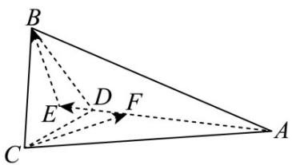

> [!faq]- 《第一章_空间向量与立体几何_高效培优讲义_》官方解析
>
> > [!success]- **【答案】** $\frac{2\sqrt{10}}{5}$
>
> > [!note]- **【解析】**
> > 设点 B, C 在直线 AD 上的投影分别为 E, F，
> >
> > 
> >
> > 因为 $AC = 2CD = 2, \angle ACD = 90^{\circ}$ ，则 $AD = \sqrt{AC^{2} + AD^{2}} = \sqrt{5}$
> >
> > 由 $\triangle ACD$ 的面积可得 $\frac{1}{2} AC\cdot CD = \frac{1}{2} CF\cdot AD$
> >
> > 则 $CF = \frac{AC\cdot CD}{AD} = \frac{2}{\sqrt{5}}$ $DF = \sqrt{CD^2 - CF^2} = \frac{1}{\sqrt{5}}$
> >
> > 且 $D$ 为边 $BC$ 的中点，可得 $BE = CF = \frac{2}{\sqrt{5}}$ ， $EF = 2DF = \frac{2}{\sqrt{5}}$
> >
> > 由二面角 $B - AD - C$ 的平面角为 $60^{\circ}$ ，可得 $\overline{CF},\overline{EB} = 120^{\circ}$
> >
> > 因为 $CB^{2} = \left( CF + FE + EB \right)^{2} = CF^{2} + FE^{2} + EB^{2} + 2CF \cdot FE + 2FE \cdot EB + 2CF \cdot EB$
> >
> > $$
> > = \frac {4}{5} + \frac {4}{5} + \frac {4}{5} + 0 + 0 + 2 \times \frac {2}{\sqrt {5}} \times \frac {2}{\sqrt {5}} \times \left(- \frac {1}{2}\right) = \frac {8}{5}
> > $$
> >
> > 即 $\left|\overrightarrow{CB}\right| = \frac{2\sqrt{10}}{5}$ ，所以空间中线段 $BC$ 的长为 $\frac{2\sqrt{10}}{5}$
> >
> > 故答案为： $\frac{2\sqrt{10}}{5}$
