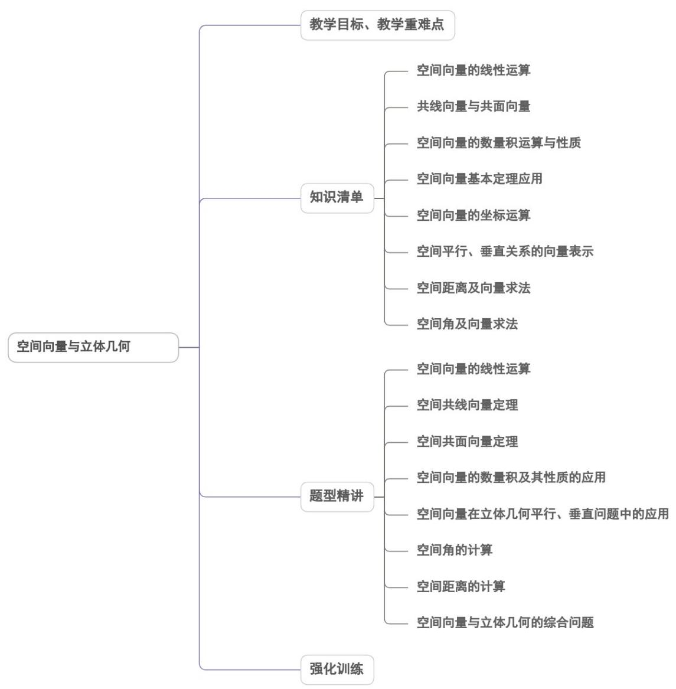

<!-- source-part:1 pages:1-50 -->

## 第一章 空间向量与立体几何

## 内容概览

## 教学目标、教学重难点

<table><tr><td>教学目标</td><td>1.理解空间向量的概念,空间向量的共线定理、共面定理及推论.2.会进行空间向量的线性运算,空间向量的数量积,空间向量的夹角的相关运算.3.会进行空间向量的线性运算,空间向量的数量积,空间向量的夹角的相关运算.4.理解并记住共线向量基本定理、平面向量基本定理、共面向量定理及空间向量基本定理的内容及含义.5.理解基底与基向量的含义,会用恰当的基向量表示空间任意向量.6.会用相关的定理解决简单的空间几何问题.7.理解和掌握空间向量的坐标表示及意义,会用向量的坐标表达空间向量的相关运算.会求空间向量的夹角、长度以及有关平行、垂直的证明.8.理解与掌握直线的方向向量,平面的法向量.9.会用方向向量,法向量证明线线、线面、面面间的平行关系;会用平面法向量证明线面和面面垂直,并能用空间向量这一工具解决与平行、垂直有关的立体几问题.</td></tr><tr><td>教学重难点</td><td>1.重点会用向量法求线线、线面、面面的夹角及与其有关的角的三角函数值;会用向量法求点点、点线、点面、线线、线面、面面之间的距离及与其有关的面积与体积.2.难点通过本节课的学习,提升平面向量、空间向量的知识相结合的综合能力,准确将平面向量、空间向量的概念,定理等内容与平面几何、空间立体几何有机的隔合在一起,提升解决问题的能力,将形与数,数与量有机的结合起来,为提升数学能力奠定基础.</td></tr></table>

![[高中/课堂同步/题库/人教A版高中数学同步讲义(2026)/03_选择性必修第一册/第一章 空间向量与立体几何/讲义/第一章_空间向量与立体几何_高效培优讲义_/知识清单_sec_01/知识清单_sec_01.md]]
![[高中/课堂同步/题库/人教A版高中数学同步讲义(2026)/03_选择性必修第一册/第一章 空间向量与立体几何/讲义/第一章_空间向量与立体几何_高效培优讲义_/知识点_01_空间向量的线性运算_sec_02/知识点_01_空间向量的线性运算_sec_02.md]]
![[高中/课堂同步/题库/人教A版高中数学同步讲义(2026)/03_选择性必修第一册/第一章 空间向量与立体几何/讲义/第一章_空间向量与立体几何_高效培优讲义_/即学即练_sec_03/即学即练_sec_03.md]]
![[高中/课堂同步/题库/人教A版高中数学同步讲义(2026)/03_选择性必修第一册/第一章 空间向量与立体几何/讲义/第一章_空间向量与立体几何_高效培优讲义_/知识点_02_共线向量与共面向量_sec_04/知识点_02_共线向量与共面向量_sec_04.md]]
![[高中/课堂同步/题库/人教A版高中数学同步讲义(2026)/03_选择性必修第一册/第一章 空间向量与立体几何/讲义/第一章_空间向量与立体几何_高效培优讲义_/即学即练_sec_05/即学即练_sec_05.md]]
![[高中/课堂同步/题库/人教A版高中数学同步讲义(2026)/03_选择性必修第一册/第一章 空间向量与立体几何/讲义/第一章_空间向量与立体几何_高效培优讲义_/知识点_03_空间向量的数量积运算与性质_sec_06/知识点_03_空间向量的数量积运算与性质_sec_06.md]]
![[高中/课堂同步/题库/人教A版高中数学同步讲义(2026)/03_选择性必修第一册/第一章 空间向量与立体几何/讲义/第一章_空间向量与立体几何_高效培优讲义_/即学即练_sec_07/即学即练_sec_07.md]]
![[高中/课堂同步/题库/人教A版高中数学同步讲义(2026)/03_选择性必修第一册/第一章 空间向量与立体几何/讲义/第一章_空间向量与立体几何_高效培优讲义_/知识点_04_空间向量基本定理应用_sec_08/知识点_04_空间向量基本定理应用_sec_08.md]]
![[高中/课堂同步/题库/人教A版高中数学同步讲义(2026)/03_选择性必修第一册/第一章 空间向量与立体几何/讲义/第一章_空间向量与立体几何_高效培优讲义_/知识点_05_空间向量的坐标运算_sec_09/知识点_05_空间向量的坐标运算_sec_09.md]]
![[高中/课堂同步/题库/人教A版高中数学同步讲义(2026)/03_选择性必修第一册/第一章 空间向量与立体几何/讲义/第一章_空间向量与立体几何_高效培优讲义_/即学即练_sec_10/即学即练_sec_10.md]]
![[高中/课堂同步/题库/人教A版高中数学同步讲义(2026)/03_选择性必修第一册/第一章 空间向量与立体几何/讲义/第一章_空间向量与立体几何_高效培优讲义_/即学即练_sec_11/即学即练_sec_11.md]]
![[高中/课堂同步/题库/人教A版高中数学同步讲义(2026)/03_选择性必修第一册/第一章 空间向量与立体几何/讲义/第一章_空间向量与立体几何_高效培优讲义_/即学即练_sec_12/即学即练_sec_12.md]]
![[高中/课堂同步/题库/人教A版高中数学同步讲义(2026)/03_选择性必修第一册/第一章 空间向量与立体几何/讲义/第一章_空间向量与立体几何_高效培优讲义_/题型精讲_sec_13/题型精讲_sec_13.md]]
![[高中/课堂同步/题库/人教A版高中数学同步讲义(2026)/03_选择性必修第一册/第一章 空间向量与立体几何/讲义/第一章_空间向量与立体几何_高效培优讲义_/题型01_空间向量的线性运算_sec_14/题型01_空间向量的线性运算_sec_14.md]]
![[高中/课堂同步/题库/人教A版高中数学同步讲义(2026)/03_选择性必修第一册/第一章 空间向量与立体几何/讲义/第一章_空间向量与立体几何_高效培优讲义_/题型02_空间共线向量定理_sec_15/题型02_空间共线向量定理_sec_15.md]]
![[高中/课堂同步/题库/人教A版高中数学同步讲义(2026)/03_选择性必修第一册/第一章 空间向量与立体几何/讲义/第一章_空间向量与立体几何_高效培优讲义_/题型03_空间共面向量定理_sec_16/题型03_空间共面向量定理_sec_16.md]]
![[高中/课堂同步/题库/人教A版高中数学同步讲义(2026)/03_选择性必修第一册/第一章 空间向量与立体几何/讲义/第一章_空间向量与立体几何_高效培优讲义_/题型04_空间向量的数量积及其性质的应用_sec_17/题型04_空间向量的数量积及其性质的应用_sec_17.md]]
![[高中/课堂同步/题库/人教A版高中数学同步讲义(2026)/03_选择性必修第一册/第一章 空间向量与立体几何/讲义/第一章_空间向量与立体几何_高效培优讲义_/题型05_空间向量在立体几何平行_垂直问题中的应用_sec_18/题型05_空间向量在立体几何平行_垂直问题中的应用_sec_18.md]]
![[高中/课堂同步/题库/人教A版高中数学同步讲义(2026)/03_选择性必修第一册/第一章 空间向量与立体几何/讲义/第一章_空间向量与立体几何_高效培优讲义_/题型06_空间角的计算_sec_19/题型06_空间角的计算_sec_19.md]]
![[高中/课堂同步/题库/人教A版高中数学同步讲义(2026)/03_选择性必修第一册/第一章 空间向量与立体几何/讲义/第一章_空间向量与立体几何_高效培优讲义_/题型07_空间距离的计算_sec_20/题型07_空间距离的计算_sec_20.md]]
![[高中/课堂同步/题库/人教A版高中数学同步讲义(2026)/03_选择性必修第一册/第一章 空间向量与立体几何/讲义/第一章_空间向量与立体几何_高效培优讲义_/题型08_空间向量与立体几何的综合问题_sec_21/题型08_空间向量与立体几何的综合问题_sec_21.md]]
![[高中/课堂同步/题库/人教A版高中数学同步讲义(2026)/03_选择性必修第一册/第一章 空间向量与立体几何/讲义/第一章_空间向量与立体几何_高效培优讲义_/强化训练_sec_22/强化训练_sec_22.md]]
