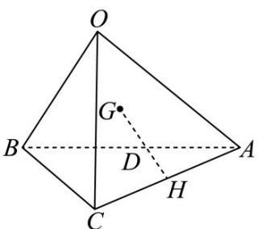

<!-- question-source:start -->
1．如图，在四面体OABC中，设 $OA = a, OB = b, OC = c$ ， $G$ 为 $\triangle OAB$ 的重心， $H$ 为 $AC$ 的中点，则 $GH =$

( )

A. $\frac{1}{6} a - \frac{1}{3} b + \frac{1}{2} c$ B. $-\frac{2}{3} a - \frac{1}{3} b - \frac{1}{3} c$ C. $\frac{1}{6} a - \frac{1}{3} b + \frac{1}{3} c$ D. $-\frac{2}{3} a - \frac{1}{3} b + \frac{1}{2} c$
<!-- question-source:end -->

![[高中/课堂同步/题库/人教A版高中数学同步讲义(2026)/03_选择性必修第一册/第一章 空间向量与立体几何/讲义/第一章_空间向量与立体几何_高效培优讲义_/即学即练_sec_03/questions/answers/Q00062909A1.md]]
