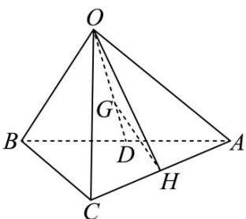

> [!faq]- 《第一章_空间向量与立体几何_高效培优讲义_》官方解析
>
> > [!success]- **【答案】** A
>
> > [!note]- **【解析】**
> > 
> >
> > 如图，连接 $OH$ ，连接 $OG$ 并延长交 $AB$ 于点 $D$ ，则 $D$ 为 $AB$ 中点，且
> >
> > $\therefore \overrightarrow{OG} = \frac{2}{3} \cdot \frac{1}{2} \left( \overrightarrow{OA} + \overrightarrow{OB} \right) = \frac{1}{3} \left( \overrightarrow{a} + \overrightarrow{b} \right)$ .
> >
> > ∵ $_{H}$ 为 AC 的中点，∴ $\stackrel{\square\square}{OH} = \frac{1}{2}\left(\stackrel{\square\square}{OA} + \stackrel{\square\square}{OC}\right) = \frac{1}{2}\left(\stackrel{\rightarrow}{a+c}\right)$
> >
> > $$
> > G H = O H - O G = \frac {1}{2} (a + c) - \frac {1}{3} (a + b) = \frac {1}{6} a - \frac {1}{3} b + \frac {1}{2} c
> > $$
> >
> > 故选 **A**.
