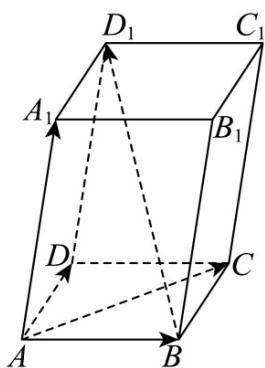

<!-- question-source:start -->
2．如图所示，平行六面体 $ABCD - A_1B_1C_1D_1$ 中， $AB = AD = 1$ ， $AA_{1} = 2$ ， $\angle BAD = \frac{\pi}{2}$ ， $\angle BAA_{1} = \angle DAA_{1} = \frac{\pi}{3}$

(1)求 $BD_{1}\cdot AC$ ;

(2)求 $AC_{1}$ 的长度.
<!-- question-source:end -->

![[高中/课堂同步/题库/人教A版高中数学同步讲义(2026)/03_选择性必修第一册/第一章 空间向量与立体几何/讲义/第一章_空间向量与立体几何_高效培优讲义_/即学即练_sec_07/questions/answers/Q00062914A1.md]]
