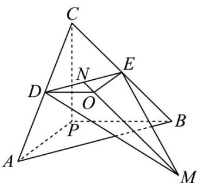

> [!faq]- 《第一章_空间向量与立体几何_高效培优讲义_》官方解析
>
> > [!success]- **【答案】** D
>
> > [!note]- **【解析】**
> > 
> >
> > 设三棱锥 $P - ABC$ 的外接球的球心为 $O$
> >
> > ∵ PA，PB，PC 两两垂直，且 PA = PB = PC = 4 ，则 AB = AC = BC = $4\sqrt{2}$
> >
> > 三棱锥 $P - ABC$ 的外接球的半径为 $\frac{1}{2}\sqrt{4^2 + 4^2 + 4^2} = 2\sqrt{3}$
> >
> > $\because D$ 为 $AC$ 的中点， $E$ 为 $BC$ 的中点， $\therefore DE = \frac{1}{2} AB = 2\sqrt{2}$ ，设 $N$ 为 $DE$ 为中点，则
> >
> > $$
> > D N = \sqrt {2} O D = 2 \therefore O N = \sqrt {O D ^ {2} - D N ^ {2}} = \sqrt {2}
> > $$
> >
> > $$
> > \therefore M D \cdot M E = \left(M N + N D\right) \cdot \left(M N + N E\right)
> > $$
> >
> > $$
> > = \left(\frac {\square \square \square}{M N} - \frac {1}{2} \frac {\square \square \square}{D E}\right) \cdot \left(\frac {\square \square \square}{M N} + \frac {1}{2} \frac {\square \square \square}{D E}\right) = \frac {\square \square \square^ {2}}{M N} - \frac {1}{4} \frac {\square \square \square^ {2}}{D E ^ {2}} = \frac {\square \square \square^ {2}}{M N} - 2
> > $$
> >
> > $$
> > = \left| M N \right| ^ {2} - 2
> > $$
> >
> > 要使 $\overline{MD} \cdot \overline{ME}$ 取到最大值，则 $\left|\overline{MN}\right|$ 必须达到最大，则M、O、N三点要共线，
> >
> > 且满足 $\left|\overline{MN}\right| = \left|\overline{MO}\right| + \left|\overline{ON}\right| = 2\sqrt{3} +\sqrt{2}$ ，故 $\overline{MD}\cdot \overline{ME} = (2\sqrt{3} +\sqrt{2})^2 -2 = 12 + 4\sqrt{6}$
> >
> > 故选 **D**.
