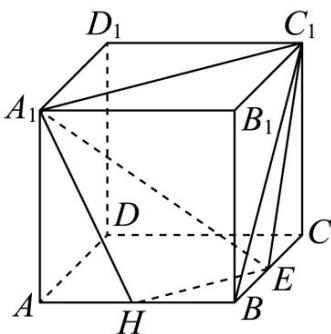
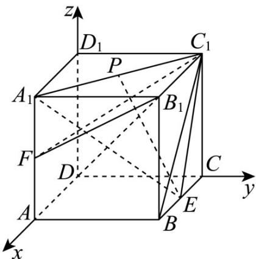

> [!faq]- 《第一章_空间向量与立体几何_高效培优讲义_》官方解析
>
> > [!success]- **【答案】** D
>
> > [!note]- **【解析】**
> > 对于 A，取 AB 的中点为 H，连接 $EH, A_{1}H$ ，如下图所示：
> >
> > 
> >
> > 由中位线性质可得 $EH \parallel AC$ ，显然 $AC \parallel A_{1}C_{1}$ ，所以 $EH \parallel A_{1}C_{1}$ ，
> >
> > 即可得 $E, H, A_{1}, C_{1}$ 四点共面，即四边形 $EHA_{1}C_{1}$ 即为平面 $A_{1}C_{1}E$ 截正方体所得截面，
> >
> > 易知 $HA_{1} = EC_{1}$ ，所以四边形 $EHA_{1}C_{1}$ 为等腰梯形，即 A 正确；
> >
> > 对于 B，以 D 为坐标原点， $DA, DC, DD_{1}$ 分别为 x, y, z 轴建立空间直角坐标系，如下图所示：
> >
> > 
> >
> > 设正方体的棱长为 2，可得 $B_{1}(2,2,2)$ , $F(2,0,1)$ , $C_{1}(0,2,2)$ , $A_{1}(2,0,2)$ , $E(1,2,0)$
> >
> > 易知 $B_{1}F = (0, - 2, - 1),B_{1}C_{1} = (-2,0,0)$
> >
> > 设平面 $B_{1}FC_{1}$ 的一个法向量为 $m = (x_{1},y_{1},z_{1})$
> >
> > 可得 $\left\{ \begin{array}{l} B_{1}E \cdot m = -2y_{1} - z_{1} = 0 \\ B_{1}C_{1} \cdot m = -2x_{1} = 0 \end{array} \right.$ ，解得 $x_{1} = 0$ ，令 $y_{1} = 1$ ，可得 $z_{1} = -2$ ；
> >
> > 所以 $m = (0,1,-2)$
> >
> > 易知 $C_{1}E = (1,0, - 2),A_{1}C_{1} = (-2,2,0)$
> >
> > 设平面 $A_{1}C_{1}E$ 的一个法向量为 $n=(x_{2},y_{2},z_{2})$
> >
> > 可得 $\left\{ \begin{array}{l} C_1E \cdot n = x_1 - 2z_1 = 0 \\ A_1C_1 \cdot n = -2x_1 + 2y_1 = 0 \end{array} \right.$ ，解得 $x_1 = 2$ ，可得 $y_1 = 2$ ， $z_1 = 1$ ；
> >
> > 所以 $n = (2,2,1)$
> >
> > 显然 $\stackrel{\cup}{m}\cdot n=0$ ，即 $\stackrel{\cup}{m}\perp n$ ，所以平面 $B_{1}FC_{1}\perp$ 平面 $A_{1}C_{1}E$ ，即 B 正确；
> >
> > 对于 C，取 $A_{1}B_{1}$ 的中点为 Q，连接 PQ, BQ，如下图所示：
> >
> > 
> >
> > 当 $P$ 为 $A_{1}C_{1}$ 的中点时，可得 $PQ / / B_{1}C_{1}$ ，且 $PQ = \frac{1}{2} B_{1}C_{1}$
> >
> > 又 $BE / / B_{1}C_{1}$ 且 $BE = \frac{1}{2} B_{1}C_{1} = \frac{1}{2} BC$ ，可得 $PQ / / BE, PQ = BE$
> >
> > 即四边形 PQBE 为平行四边形，可得 BQ // EP ，
> >
> > 又 $BQ \subset$ 平面 $AA_{1}B_{1}B$ ， $EP \not\subset$ 平面 $AA_{1}B_{1}B$ ，即 $EP \parallel$ 平面 $AA_{1}B_{1}B$ ；
> >
> > 所以存在点 P 为 $A_{1}C_{1}$ 的中点时，使得 $EP \parallel$ 平面 $AA_{1}B_{1}B$ ，可得 C 正确；
> >
> > 对于 D，由 B 选项中空间直角坐标系如下图所示：
> >
> > 
> >
> > 可得 $D(0,0,0)$ , $B_{1}(2,2,2)$ , $E(1,2,0)$ ，即 $DB_{1}=(2,2,2)$
> >
> > 设 $\overset{\square\square}{A_{1}}P=\lambda\overset{\square\square}{A_{1}}C_{1}=(-2\lambda,2\lambda,0),\lambda\in[0,1]$ ，则 $\overset{\square\square}{E}P=\overset{\square\square}{E}A_{1}+\overset{\square\square}{A_{1}}P=(1,-2,2)+(-2\lambda,2\lambda,0)=(1-2\lambda,-2+2\lambda,2)$
> >
> > 此时 $\overline{DB_{1}}\cdot\overline{EP}=2(1-2\lambda-2+2\lambda+2)=2\neq0$ ，即 $\overline{DB_{1}}\perp\overline{EP}$ 不成立；
> >
> > 所以不存在点 P，使得 $DB_{1} \perp EP$ ，即 D 错误.
> >
> > 故选：D
> >
> > 知识点 07 空间距离及向量求法
> >
> > <table><tr><td>分类</td><td>点到直线的距离</td><td>点到平面的距离</td></tr><tr><td>图形语言</td><td></td><td></td></tr><tr><td>文字语言</td><td>设u为直线l的单位方向向量,A∈l,P∉l,AP=a,向量AP在直线l上的投影向量为AQ(AQ=(a·u)u.),则PQ=APAQ=</td><td>设已知平面α的法向量为n,A∈α,P∉α,向量AQ是向量AP在平面上的投影向量,PQ=AP=AP注:实质上,n是直线l的方向向量,点P到平面α的距离就是AP在直线l上的投影向量QP的长度.</td></tr></table>
