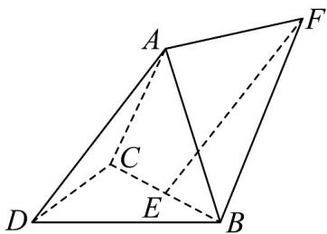

<!-- question-source:start -->
1．如图，三棱锥 A-BCD 中，AB=BC=AC=DB=DC，且平面 ABC 与底面 BCD 垂直，E 为 BC 中点， $EF = DA$ ，则平面 ADB 与平面 ABF 夹角的余弦值为（）

A. $\frac{\sqrt{5}}{5}$ B. $\frac{2\sqrt{5}}{5}$ C. $\frac{\sqrt{6}}{3}$ D. 1
<!-- question-source:end -->

![[高中/课堂同步/题库/人教A版高中数学同步讲义(2026)/03_选择性必修第一册/第一章 空间向量与立体几何/讲义/第一章_空间向量与立体几何_高效培优讲义_/即学即练_sec_12/questions/answers/Q00062921A1.md]]
