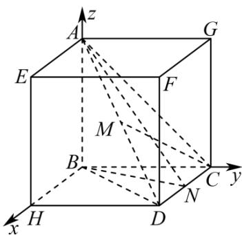

> [!faq]- 《第一章_空间向量与立体几何_高效培优讲义_》官方解析
>
> > [!success]- **【答案】** D
>
> > [!note]- **【解析】**
> > 由题可知 $AB, BC, CD$ 两两垂直，且 $AB = BC = CD = 2$
> >
> > 因此，如图所示正方体内的三棱锥 A-BCD 即为满足题意的鳖臑 A-BCD
> >
> > 以 $B$ 为原点，建立如图所示的空间直角坐标系，正方体棱长为2，
> >
> > 
> >
> > 则 $B(0,0,0)$ ， $A(0,0,2)$ ， $C(0,2,0)$ ， $M(1,1,1)$ ， $N(1,2,0)$ ，则 $\overline{CM} = (1, -1, 1)$ ， $\overline{BA} = (0, 0, 2)$ ， $\overline{BN} = (1, 2, 0)$
> >
> > 设平面 $ABN$ 的法向量为 $n = (x, y, z)$
> >
> > 则 $\left\{ \begin{array}{l} B A \cdot n = 0, \\ B N \cdot n = 0, \end{array} \right.$ 即 $\left\{ \begin{array}{l} 2 z = 0, \\ x + 2 y = 0, \end{array} \right.$
> >
> > 故可取 $n = (2, -1, 0)$ 。设直线 $CM$ 与平面 $ABN$ 所成角为 $\theta$
> >
> > 则 $\sin\theta=\frac{\left|\begin{matrix}CM\\CM\end{matrix}\cdot n\end{matrix}\right|}{\left|\begin{matrix}CM\\CM\end{matrix}\right|\cdot\left|n\right|}=\frac{3}{\sqrt{3}\times\sqrt{5}}=\frac{\sqrt{15}}{5}$ ，故 $\cos\theta=\sqrt{1-\left(\frac{\sqrt{15}}{5}\right)^{2}}=\frac{\sqrt{10}}{5}$ ，
> >
> > 故选 **D**.
