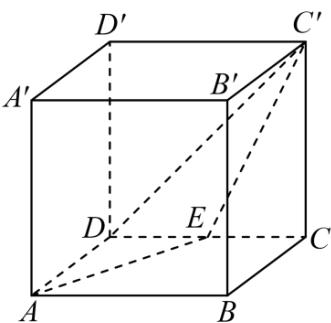

<!-- question-source:start -->
8. 如图，在棱长为 1 的正方体 $ABCD - A'B'C'D'$ 中， $E$ 为 $CD$ 的中点，则点 $D^{\ddagger}$ 到平面 $AEC'$ 的距离为（）

A. $\frac{\sqrt{2}}{3}$ B. $\frac{\sqrt{5}}{3}$ C. $\frac{\sqrt{3}}{3}$ D. $\frac{\sqrt{6}}{3}$
<!-- question-source:end -->

![[高中/课堂同步/题库/人教A版高中数学同步讲义(2026)/03_选择性必修第一册/第一章 空间向量与立体几何/讲义/第一章_空间向量与立体几何_高效培优讲义_/强化训练_sec_22/questions/answers/Q00062953A1.md]]
