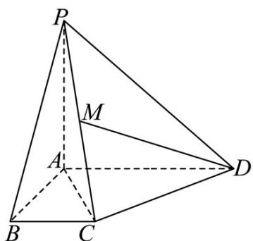

<!-- question-source:start -->
11．如图，在四棱锥 P-ABCD 中，底面 ABCD 为直角梯形， $AD \parallel BC$ ， $\angle BAD = 90^{\circ}$ ， $PA \perp$ 底面 ABCD，

且 $PA = AD = AB = 2BC = 2$ ， $M$ 为 $PC$ 的中点.

(1)求证： $PB\bot DM$

(2)求 $DM$ 的长；

(3)求 $\cos AC, PD$
<!-- question-source:end -->

![[高中/课堂同步/题库/人教A版高中数学同步讲义(2026)/03_选择性必修第一册/第一章 空间向量与立体几何/讲义/第一章_空间向量与立体几何_高效培优讲义_/强化训练_sec_22/questions/answers/Q00062956A1.md]]
