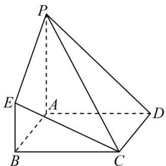

<!-- question-source:start -->
13．如图，四边形 ABCD 为正方形， $PA \perp$ 平面 ABCD ， $PA // BE$ ，AB = PA = 4，BE = 2。

(1)求 PD 与平面 PCE 所成角的正弦值；

(2)在棱 $AB$ 上是否存在一点 $F$ ，使得平面 $DEF \perp$ 平面 $PCE$ 说明理由.
<!-- question-source:end -->

![[高中/课堂同步/题库/人教A版高中数学同步讲义(2026)/03_选择性必修第一册/第一章 空间向量与立体几何/讲义/第一章_空间向量与立体几何_高效培优讲义_/强化训练_sec_22/questions/answers/Q00062958A1.md]]
