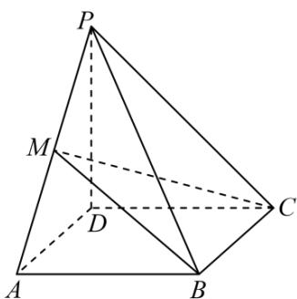

<!-- question-source:start -->
15．如图，在四棱锥 P-ABCD 中，底面 ABCD 是矩形，M 是 PA 的中点， $PD \perp$ 平面 ABCD，且

$PD = CD = 4$ ， $AD = 2$ 求：

(1) $AP$ 与平面 $CMB$ 所成角的正弦值；

(2)平面 $MCB$ 与平面 $PCB$ 夹角的余弦值.
<!-- question-source:end -->

![[高中/课堂同步/题库/人教A版高中数学同步讲义(2026)/03_选择性必修第一册/第一章 空间向量与立体几何/讲义/第一章_空间向量与立体几何_高效培优讲义_/强化训练_sec_22/questions/answers/Q00062960A1.md]]
