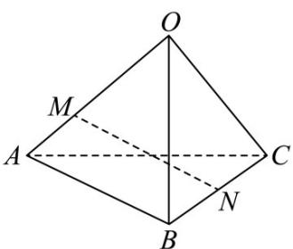

> [!faq]- 《第一章_空间向量与立体几何_高效培优讲义_》官方解析
>
> > [!success]- **【答案】** D
>
> > [!note]- **【解析】**
> > 
> >
> > 由题意， $MN = ON - OM = \frac{1}{2}(OB + OC) - \frac{2}{3}OA = -\frac{2}{3}a + \frac{1}{2}b + \frac{1}{2}c$ .
> >
> > 故选 **D**.
