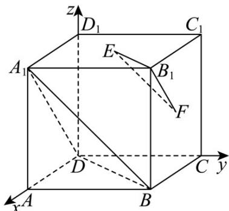

> [!faq]- 《第一章_空间向量与立体几何_高效培优讲义_》官方解析
>
> > [!success]- **【答案】** (1)证明见解析 (2)证明见解析
>
> > [!note]- **【解析】**
> > （1）以 $D$ 为原点， $DA$ ， $DC$ ， $DD_{1}$ 分别为 $x$ 轴、 $y$ 轴、 $z$ 轴，建立空间直角坐标系，
> >
> > 
> >
> > 令正方体的棱长为 2，则 $D(0,0,0)$ ， $A_{1}(2,0,2)$ ， $B(2,2,0)$ ， $B_{1}(2,2,2)$ ， $E(1,1,2)$ ， $F(1,2,1)$
> >
> > 证法 1： $EF = (0,1,-1)$ ， $A_{1}B = (0,2,-2)$ ，因为 $A_{1}B = 2EF$ ，所以 $A_{1}B // EF$ ，又 $A_{1}B \subset$ 平面 $A_{1}BD$ ， $EF \not\subset$ 平面 $A_{1}BD$ ，所以 $EF //$ 平面 $A_{1}BD$
> >
> > 证法2：设平面 $A_{1}BD$ 的一个法向量 $n = (x,y,z)$ ， $\overline{DA}_{1} = (2,0,2)$ ， $\overline{DB} = (2,2,0)$ ，根据 $\left\{ \begin{array}{l} \overline{DA}_{1} \cdot n = 0 \\ \overline{DB} \cdot n = 0 \end{array} \right.$ ，可得
> >
> > $\left\{ \begin{array}{l} 2x + 2z = 0 \\ 2x + 2y = 0 \end{array} \right.$ ，令 $x = -1$ ，则 $y = 1$ ， $z = 1$ ，即 $n = (-1, 1, 1)$
> >
> > 因为 $\stackrel{\mathrm{uuu}}{EF} \cdot n = 0$ ，又 $A_{1}B \subset$ 平面 $A_{1}BD$ ， $EF \notin$ 平面 $A_{1}BD$ ，所以 $EF //$ 平面 $A_{1}BD$
> >
> > （2）设平面 $B_{1}EF$ 的一个法向量 $m = (x_0,y_0,z_0)$ ， $\overline{B_1F} = (-1,0, - 1)$ ， $\overline{EF} = (0,1, - 1)$ ，根据 $\left\{ \begin{array}{ll}E F\cdot m = 0\\ B_1F\cdot m = 0 \end{array} \right.$ ，可得
> >
> > $\left\{ \begin{array}{l} y - z = 0 \\ -x - z = 0 \end{array} \right.$ ，取 $y = 1$ ，则 $m = (-1,1,1)$ ，所以 $\stackrel{\sqcup}{m} = n$ ，则 $\stackrel{\sqcup}{m} //n$ ，所以平面 $B_{1}EF //$ 平面 $A_{1}BD$ 。
