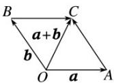

## 知识点 01 空间向量的线性运算

## （一）空间向量的加减运算

<table><tr><td rowspan="2">加法运算</td><td rowspan="2">三角形法则</td><td>语言叙述</td><td colspan="2">首尾顺次相接,首指向尾为和</td></tr><tr><td>图形叙述</td><td></td><td></td></tr><tr><td rowspan="2"></td><td rowspan="2">平行四边形法则</td><td>语言叙述</td><td colspan="2">共起点的两边为邻边作平行四边形,共起点对角线为和</td></tr><tr><td>图形叙述</td><td colspan="2"></td></tr><tr><td rowspan="2">减法运算</td><td rowspan="2">三角形法则</td><td>语言叙述</td><td colspan="2">共起点,连终点,方向指向被减向量</td></tr><tr><td>图形叙述</td><td colspan="2"></td></tr><tr><td rowspan="2">加法运算</td><td>交换律</td><td colspan="3">a+b=b+a</td></tr><tr><td>结合律</td><td colspan="3">(a+b)+c=a+(b+c)</td></tr></table>

## （二）空间向量的数乘运算

<table><tr><td>定义</td><td colspan="3">与平面向量一样,实数λ与空间向量a的乘积λa仍然是一个向量,称为空间向量的数乘</td></tr><tr><td rowspan="3">几何意义</td><td>λ&gt;0</td><td>λa与向量a的方向相同</td><td rowspan="3">λa的长度是a的长度的 $\lambda$ 倍</td></tr><tr><td>λ&lt;0</td><td>λa与向量a的方向相反</td></tr><tr><td>λ=0</td><td>λa=0,其方向是任意的</td></tr><tr><td rowspan="2">运算律</td><td>结合律</td><td colspan="2"> $\lambda(\mu a)=(\lambda\mu)a$ </td></tr><tr><td>分配律</td><td colspan="2"> $(\lambda+\mu)a=\lambda a+\mu a,\lambda(a+b)=\lambda a+\lambda b$ </td></tr></table>
