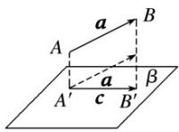

## 知识点 03 空间向量的数量积运算与性质

## 1. (1) 空间向量的数量积

已知两个非零向量 $a, b$ ，则 $|a||b|\cos \langle a, b\rangle$ 叫做 $a, b$ 的数量积，记作 $a \cdot b$ ，即 $a \cdot b = |a||b|\cdot \cos \langle a, b\rangle$ 。零向量与任意向量的数量积为 0，即 $0 \cdot a = 0$ .

(2)运算律

<table><tr><td>数乘向量与数量积的结合律</td><td> $(\lambda a) \cdot b = \lambda (a \cdot b), \lambda \in R$ </td></tr><tr><td>交换律</td><td> $a \cdot b = b \cdot a$ </td></tr><tr><td>分配律</td><td> $a \cdot (b + c) = a \cdot b + a \cdot c$ </td></tr></table>

## 2. 投影向量及直线与平面所成的角

(1)如图①，在空间，向量 $a$ 向向量 $b$ 投影，由于它们是自由向量，因此可以先将它们平移到同一个平面 $a$ 内，进而利用平面上向量的投影，得到与向量 $b$ 共线的向量 $c$ ， $c = |a|\cos \langle a, b \rangle$ ，向量 $c$ 称为向量 $a$ 在向量 $b$ 上的投影向量。类似地，可以将向量 $a$ 向直线 $l$ 投影(如图②)。

(2)如图③，向量 $a$ 向平面 $\beta$ 投影，就是分别由向量 $a$ 的起点 $A$ 和终点 $B$ 作平面 $\beta$ 的垂线，垂足分别为 $A'$ ， $B'$ ，得到向量 $\mathrm{A'B'}$ ，向量 $\mathrm{A'B'}$ 称为向量 $a$ 在平面 $\beta$ 上的投影向量。这时，向量 $a$ ， $\mathrm{A'B'}$ 的夹角就是向量 $a$ 所在直线与平面 $\beta$ 所成的角。

②

①

③

## 3. 空间向量数量积的性质

(1)若 $a, b$ 为非零向量，则 $a \perp b \Leftrightarrow a \cdot b = 0$ ；

(2) $a\cdot a=|a|^{2}$ 或 $|a|=$ = ;

(3)若 $a, b$ 为非零向量，则 $\cos \langle a, b \rangle =$ ;

(4) $|a\cdot b|\leq|a||b|$ (当且仅当a，b共线时等号成立).
