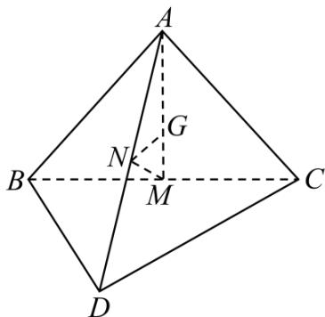

<!-- question-source:start -->
【变式2】如图，四面体ABCD中，M、N分别是线段BC、AD的中点，已知 $\overline{AG} = \frac{2\overline{u}\overline{u}\overline{u}\overline{r}}{3AM}$

(1) $NM = \frac{1}{2}(NB + NC)$ ;

(2) $NM = DB + \frac{1}{2} AC$ ;

(3) $NG = \frac{1}{3}(NA + NB + NC)$ ;

(4) 存在实数 $x, y$ ，使得 $\overline{NG} = x\overline{DB} + y\overline{DC}$ .

则其中正确的结论是\_\_\_\_．（把你认为是正确的所有结论的序号都填上）.
<!-- question-source:end -->

![[高中/课堂同步/题库/人教A版高中数学同步讲义(2026)/03_选择性必修第一册/第一章 空间向量与立体几何/讲义/第一章_空间向量与立体几何_高效培优讲义_/题型01_空间向量的线性运算_sec_14/questions/answers/Q00062924A1.md]]
