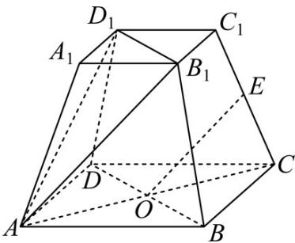

<!-- question-source:start -->
【变式3】在正四棱台 $ABCD - A_1B_1C_1D_1$ 中， $AB = 3\sqrt{2}$ ， $A_1B_1 = 2\sqrt{2}$ ， $AA_1 = 2$ ， $AC \cap BD = O$ ， $CE = \lambda CC_1$

若 $OE \parallel$ 平面 $AB_{1}D_{1}$ ，则 $\lambda =$ \_\_\_\_.

<!-- question-source:end -->

![[高中/课堂同步/题库/人教A版高中数学同步讲义(2026)/03_选择性必修第一册/第一章 空间向量与立体几何/讲义/第一章_空间向量与立体几何_高效培优讲义_/题型01_空间向量的线性运算_sec_14/questions/answers/Q00062925A1.md]]
