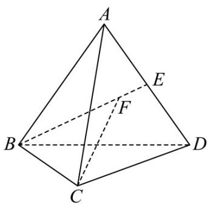

## 题型01 空间向量的线性运算

【典例1】如图，在四面体 $OABC$ 中， $M$ 为棱 $BC$ 的中点，点 $N, P$ 分别满足 $\overline{ON} = 2NM$ ， $\overline{AP} = \frac{2}{3}AN$ 则 $\overline{OP} =$ （）

A. $\frac{1}{3} OA + \frac{2}{3} OB + \frac{2}{3} OC$ B. $\frac{1}{3} OA + \frac{2}{9} OB + \frac{2}{9} OC$ C. $\frac{1}{3} OA + \frac{4}{9} OB + \frac{4}{9} OC$ D. $\frac{1}{3} OA + \frac{1}{3} OB + \frac{1}{3} OC$

【答案】B

【详解】 $OP=\frac{OA+AP=OA+\frac{2}{3}AN=OA+\frac{2}{3}(ON-OA)=\frac{1}{3}OA+\frac{2}{3}ON}$

$$
= \frac {1}{3} \square O A + \frac {2}{3} \times \frac {2}{3} \square O M = \frac {1}{3} \square O A + \frac {4}{9} \square O M = \frac {1}{3} \square O A + \frac {4}{9} \times \frac {1}{2} (\square O B + \square O C) = \frac {1}{3} \square O A + \frac {2}{9} \square O B + \frac {2}{9} \square O C
$$

故选：B

【典例2】在四面体ABCD中，E为棱AD的中点，点F为线段BE上一点，且 $BF=4FE$ ，设 $AB=m$ ，
AC=n, AD=t, 则CF=( )
A. $\frac{1}{5}m-n-\frac{2}{5}t$ B. $\frac{1}{5}m-n+\frac{2}{5}t$

C. $\frac{1}{5} m + n - \frac{2}{5} t$ D. $\frac{2}{5} m - n + \frac{1}{5} t$

【答案】B

【详解】

因为 E 为棱 AD 的中点，所以

$$
B E = A E - A B = \frac {1}{2} A D - A B
$$

因为 $BF = 4FE$ ，所以

$$
C F = C B + B F = A B - A C + \frac {2}{5} A D - \frac {4}{5} A B = \frac {1}{5} A B - A C + \frac {2}{5} A D = \frac {1}{5} m - n + \frac {2}{5} t
$$

故选：B.

## 方法技巧

在用已知向量表示未知向量的时候，要注意寻求两者之间的关系，通常可将未知向量进行一系列的转化，将

其转化到与已知向量在同一四边形（更多的是平行四边形）或三角形中，从而可以建立已知与未知之间的关

系式．另外，在平行六面体中，要注意相等向量之间的代换．

![[高中/课堂同步/题库/人教A版高中数学同步讲义(2026)/03_选择性必修第一册/第一章 空间向量与立体几何/讲义/第一章_空间向量与立体几何_高效培优讲义_/题型01_空间向量的线性运算_sec_14/questions/Q00062923.md]]
![[高中/课堂同步/题库/人教A版高中数学同步讲义(2026)/03_选择性必修第一册/第一章 空间向量与立体几何/讲义/第一章_空间向量与立体几何_高效培优讲义_/题型01_空间向量的线性运算_sec_14/questions/Q00062924.md]]
![[高中/课堂同步/题库/人教A版高中数学同步讲义(2026)/03_选择性必修第一册/第一章 空间向量与立体几何/讲义/第一章_空间向量与立体几何_高效培优讲义_/题型01_空间向量的线性运算_sec_14/questions/Q00062925.md]]
