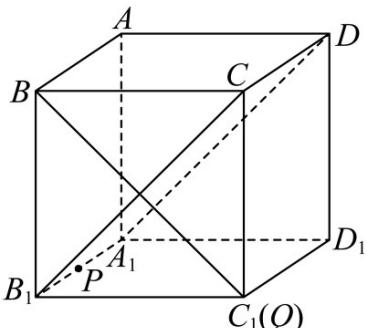

> [!faq]- 《第一章_空间向量与立体几何_高效培优讲义_》官方解析
>
> > [!success]- **【答案】** 1
>
> > [!note]- **【解析】**
> > $\overline{AP}=\overline{AA_{1}}+\lambda\overline{AB}\Leftrightarrow\overline{AP}-\overline{AA_{1}}=\lambda\overline{AB}\Leftrightarrow\overline{A_{1}P}=\lambda\overline{AB},$ 又 $\lambda\in[0,2]$
> >
> > 所以点 P 在射线 $A_{1}B_{1}$ 上；
> >
> > $$
> > \stackrel {\text {   }} {A} \stackrel {\text {   }} {Q} = \mu \stackrel {\text {   }} {A} \stackrel {\text {   }} {A} _ {1} + \stackrel {\text {   }} {A} \stackrel {\text {   }} {B} + \stackrel {\text {   }} {A} \stackrel {\text {   }} {D} \Leftrightarrow \stackrel {\text {   }} {A} \stackrel {\text {   }} {Q} = \mu \stackrel {\text {   }} {A} \stackrel {\text {   }} {A} _ {1} + \stackrel {\text {   }} {A} \stackrel {\text {   }} {C} \Leftrightarrow \stackrel {\text {   }} {A} \stackrel {\text {   }} {1} Q - \stackrel {\text {   }} {A} C = \mu \stackrel {\text {   }} {A} \stackrel {\text {   }} {A} _ {1} \Leftrightarrow \stackrel {\text {   }} {C} \stackrel {\text {   }} {Q} = \mu \stackrel {\text {   }} {A} \stackrel {\text {   }} {A} _ {1}, \text {又} \mu \in [ 0, 2 ]
> > $$
> >
> > 所以点 Q 在射线 $CC_{1}$ 上；
> >
> > 
> >
> > 因为当 $\lambda$ 变化时， $DP \subset$ 平面 $A_{1}B_{1}CD$ ，故只需考虑过 B 且与平面 $A_{1}B_{1}CD$ 垂直的线，
> >
> > 因为正方体有 $A_{1}B_{1} \perp$ 平面 $BB_{1}C_{1}C$ ，而 $BC_{1} \subset$ 平面 $BB_{1}C_{1}C$ ，所以 $A_{1}B_{1} \perp BC_{1}$ ，
> >
> > 又 $BC_{1} \perp B_{1}C$ ， $A_{1}B_{1} \cap B_{1}C = B_{1}, A_{1}B_{1}, B_{1}C \subset$ 平面 $A_{1}B_{1}CD$ ，所以 $BC_{1} \perp$ 平面 $A_{1}B_{1}CD$
> >
> > $DP \subset_{平面} A_{1}B_{1}CD$ ，所以 $BC_{1} \perp DP$ ，
> >
> > 所以当点 Q 在 $C_{1}$ 上时 $DP \perp BQ$ ，即 $\mu = 1$ 时 $DP \perp BQ$ ，
> >
> > 故答案为：1.
