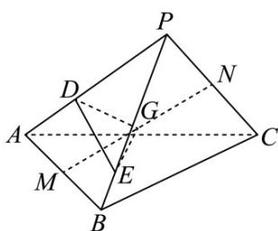

> [!faq]- 《第一章_空间向量与立体几何_高效培优讲义_》官方解析
>
> > [!success]- **【答案】** $\frac{6}{7}$
>
> > [!note]- **【解析】**
> > 
> >
> > 由题意得， $PG=\frac{1}{2}PM+\frac{1}{2}PN=\frac{1}{2}\cdot\frac{1}{2}\left(PA+PB\right)+\frac{1}{2}\cdot\frac{1}{2}PC=\frac{1}{4}PA+\frac{1}{4}PB+\frac{1}{4}PC$
> >
> > $$
> > \begin{array}{c c c c c} \square \square \square & \\ P D = \frac {2}{3} \square \square & \\ P E = \frac {3}{4} \square \square & \\ P F = \lambda P C & \end{array} \quad \begin{array}{c c c c c} \square \square \square & \\ P A = \frac {3}{2} \square \square & \\ P B = \frac {4}{3} \square \square & \\ P C = \frac {1}{\lambda} \square \square & \end{array}
> > $$
> >
> > $$
> > P G = \frac {1}{4} \times \frac {3}{2} P D + \frac {1}{4} \times \frac {4}{3} P E + \frac {1}{4} \times \frac {1}{I} P F = \frac {3}{8} P D + \frac {1}{3} P E + \frac {1}{4 I} P F
> > $$
> >
> > ∵点G,D,E,F四点共面，∴ $\frac{3}{8}+\frac{1}{3}+\frac{1}{4\lambda}=1$ ，解得 $\lambda=\frac{6}{7}$
> >
> > 故答案为： $\frac{6}{7}$
