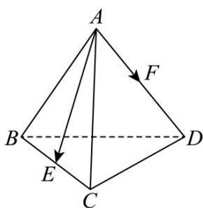
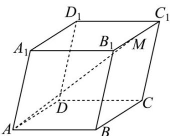
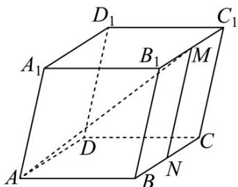

## 题型04 空间向量的数量积及其性质的应用

【典例1】设正四面体ABCD的棱长为a，E，F分别是BC，AD的中点，则 $AE\cdot AF$ 的值为（）
A. $\frac{\sqrt{3}}{4}a^{2}$ B. $\frac{1}{2}a^{2}$ C. $a^{2}$ D. $\frac{1}{4}a^{2}$

【答案】D

【详解】如图所示，因为 $E, F$ 分别为 $BC, AD$ 的中点，可得 $\frac{AE}{2} = \frac{1}{2}(AB + AC)$ $\frac{AF}{2} = \frac{1}{2}AD$

又因为四面体 ABCD 为正四面体，且棱长为 a ，

可得 $AE \cdot AF = \frac{1}{4} (AB + AC) \cdot AD = \frac{1}{4} (AB \cdot AD + AC \cdot AD)$

$$
= \frac {1}{4} \left(\left| \overline {{A B}} \right| \cdot \left| \overline {{A D}} \right| \cos \frac {\pi}{3} + \left| \overline {{A C}} \right| \left| \overline {{A D}} \right| \cos \frac {\pi}{3}\right) = \frac {1}{4} \left(a ^ {2} \times \frac {1}{2} + a ^ {2} \times \frac {1}{2}\right) = \frac {1}{4} a ^ {2},
$$

故选：D.

【典例2】在平行六面体 $ABCD - A_{1}B_{1}C_{1}D_{1}$ 中 $\angle BAD = 90^{\circ}$ ， $AB = AD = AA_{1} = 1$ ， $\angle BAA_{1} = \angle DAA_{1} = 60^{\circ}$ 。取棱 $B_{1}C_{1}$ 的中点 $M$ ，则 $\left|\overline{AM}\right| = (\quad)$

A. $\frac{\sqrt{15}}{3}$ B. $\frac{\sqrt{15}}{2}$ C. $\frac{\sqrt{10}}{2}$ D. $\frac{\sqrt{10}}{3}$

【答案】B

【详解】取 BC 的中点 N ，连接 MN ，

由图形可得 $AM = AB + BN + NM$

所以 $\left|AM\right|^{2}=\left(AB+BN+NM\right)^{2}$

$$
= \left| \begin{array}{c} \text {UUU} \\ A B \end{array} \right| ^ {2} + \left| \begin{array}{c} \text {UUU} \\ B N \end{array} \right| ^ {2} + \left| \begin{array}{c} \text {UUUU} \\ N M \end{array} \right| ^ {2} + 2 \left| \begin{array}{c} \text {UUU} \\ A B \end{array} \right| \left| \begin{array}{c} \text {UUU} \\ B N \end{array} \right| \cos 9 0 ^ {\circ} + 2 \left| \begin{array}{c} \text {UUU} \\ A B \end{array} \right| \left| \begin{array}{c} \text {UUUU} \\ N M \end{array} \right| \cos 6 0 ^ {\circ} + 2 \left| \begin{array}{c} \text {UUUU} \\ N M \end{array} \right| \left| \begin{array}{c} \text {UUU} \\ B N \end{array} \right| \cos 6 0 ^ {\circ}
$$

$$
= 1 + \frac {1}{4} + 1 + 0 + 2 \times 1 \times 1 \times \frac {1}{2} + 2 \times 1 \times \frac {1}{2} \times \frac {1}{2} = \frac {1 5}{4},
$$

所以 $\left|\begin{matrix}\overrightarrow{AM}\\\end{matrix}\right|=\frac{\sqrt{15}}{2}$

故选：B

## 方法技巧

向量的数量积运算除不满足乘法结合律外，其它都满足，所以其运算和实数的运算基本相同。求空间向量数

量积的运算同平面向量一样，关键在于确定两个向量之间的夹角以及它们的模，利用公式：

$a \cdot b = |a| \cdot |b| \cdot \cos \langle a, b \rangle$ 即可顺利计算.

1.利用空间向量的数量积求两向量的夹角：本题用传统立体几何方法求异面直线BN和SM所成角，可以利用

中位线平移或补形在正方体中计算，但是图形添加辅助线后不易观察，计算量也稍大。如用向量夹角公式

$\cos \langle BN, SM \rangle = \frac{BN \cdot SM}{|BN| \cdot |SM|}$ 求解，无须添加辅助线，便于观察图形，更能有效地解决问题。

2.利用空间向量的数量积求线段的长度：空间向量求模的运算要注意公式的准确应用。向量的模就是表示向

量的有向线段的长度，因此求线段长度的总是可用向量求解。

3.利用空间向量的数量积证垂直：立体几何中有关判断线线垂直问题，通常可以转化为求向量的数量积为零
![[高中/课堂同步/题库/人教A版高中数学同步讲义(2026)/03_选择性必修第一册/第一章 空间向量与立体几何/讲义/第一章_空间向量与立体几何_高效培优讲义_/_compact/Q00062932.md]]
![[高中/课堂同步/题库/人教A版高中数学同步讲义(2026)/03_选择性必修第一册/第一章 空间向量与立体几何/讲义/第一章_空间向量与立体几何_高效培优讲义_/_compact/Q00062933.md]]
![[高中/课堂同步/题库/人教A版高中数学同步讲义(2026)/03_选择性必修第一册/第一章 空间向量与立体几何/讲义/第一章_空间向量与立体几何_高效培优讲义_/_compact/Q00062934.md]]
