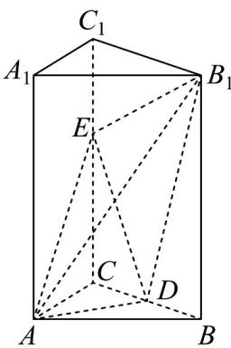
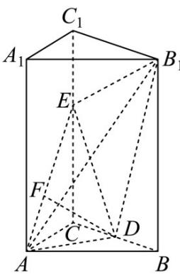
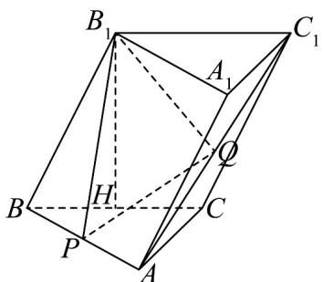
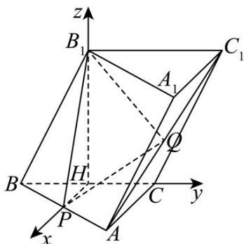

## 题型05 空间向量在立体几何平行、垂直问题中的应用

【典例1】如图，正三棱柱 $ABC - A_{1}B_{1}C_{1}$ 中， $AB = 2$ ， $AA_{1} = 3$ ， $D$ 是 $BC$ 中点， $E$ 是棱 $CC_{1}$ 上一点.

(1)求证： $AD \perp$ 平面 $BCC_{1}B_{1}$ ;

(2)若平面 $B_{1}EA \perp$ 平面ADE，求CE的长.

【答案】(1)证明见解析

(2) $CE = 1$ 或2

【详解】（1）

在正三棱柱 $ABC - A_{1}B_{1}C_{1}$ 中，

因为 $CC_{1} \perp$ 平面 $ABC$ ， $AD \subset$ 平面 $ABC$ ，所以 $AD \perp CC_{1}$

因为 VABC 是正三角形，D 是 BC 中点，所以 $AD \perp BC$

又 $CC_{1} \cap BC = C$ ， $CC_{1}$ ， $BC \subset$ 平面 $BCC_{1}B_{1}$ ，所以 $AD \perp$ 平面 $BCC_{1}B_{1}$

(2) 解法一：

在VADE中过点D作DF⊥AE，垂足为F

又平面 $B_{1}EA \perp$ 平面 $ADE$ ，平面 $B_{1}EA \cap$ 平面 $ADE = AE$ ， $DF \subset$ 平面 $ADE$

所以 $DF \perp$ 平面 $B_{1}EA$ 。又 $B_{1}E \subset$ 平面 $B_{1}EA$ ，所以 $B_{1}E \perp DF$

由（1）知 $B_{1}E \perp AD$ ，且 $DF \cap AD = D$ ， $DF, AD \subset$ 平面 $ADE$

所以 $B_{1}E \perp$ 平面 $ADE$ ，又 $DE \subset$ 平面 $ADE$ ，所以 $B_{1}E \perp DE$

设 $CE = m$ ，则 $C_1E = 3 - m$ ， $B_{1}E = \sqrt{(3 - m)^{2} + 4}$ ， $DE = \sqrt{m^2 + 1}$ ， $B_{1}D = \sqrt{10}$

由勾股定理得 $B_{1}D^{2} = DE^{2} + B_{1}E^{2}$ ，即 $m^2 - 3m + 2 = 0$ ，解得 $m = 1$ 或 $m = 2$

所以 $CE = 1$ 或2

解法二：

在正三棱柱 $ABC - A_{1}B_{1}C_{1}$ 中，取 $B_{1}C_{1}$ 中点 $D_{1}$ ，连结 $DD_{1}$

则 DA，DB， $DD_{1}$ 两两垂直，以 $\left\{DA, DB, DD_{1}\right\}$ 为正交基底，

建立如图所示的空间直角坐标系 $D - xyz$

设 $CE = m$ ，则 $D(0,0,0)$ ， $E(0, - 1,m)$ ， $A(\sqrt{3},0,0)$ ， $B_{1}(0,1,3)$

设平面 $ADE$ 的一个法向量 $\stackrel{\square}{n}_{1} = (x,y,z)$

因为 $\overline{DA} = (\sqrt{3}, 0, 0)$ ， $\overline{DE} = (0, -1, m)$ ，

由 $\left\{\begin{aligned}\boldsymbol{n}_{1} & \cdot D A = 0, \\ n_{1} & \cdot DE = 0,\end{aligned}\right.$ 即 $\left\{\begin{aligned}\sqrt{3}x &= 0, \\ -y + mz &= 0, \end{aligned}\right.$ 解得 x = 0，y = mz，

取 $z = 1$ ，则 $y = m$ ，得 $\stackrel{\square}{n}_{1} = (0,m,1)$

设平面 $B_{1}EA$ 的一个法向量 $n_{2}^{u}= (x, y, z)$

因为 $\stackrel{\square\square\square}{B}_{1}A=(\sqrt{3},-1,-3)$ ， $\stackrel{\square\square\square}{B}_{1}E=(0,-2,m-3)$

由 $\left\{ \begin{array}{l} n_{2} \cdot B_{1}A = 0, \\ n_{2} \cdot B_{1}E = 0, \end{array} \right.$ 即 $\left\{ \begin{array}{l} \sqrt{3} x - y - 3z = 0, \\ -2y + (m - 3)z = 0, \end{array} \right.$

解得 $x=\frac{m+3}{2\sqrt{3}}\cdot z,\quad y=\frac{m-3}{2}\cdot z$

取 $z = 2\sqrt{3}$ ，则 $x = m + 3$ ， $y = \sqrt{3} m - 3\sqrt{3}$

得 $n_2 = (m + 3, \sqrt{3} m - 3\sqrt{3}, 2\sqrt{3})$

因为平面 $B_{1}EA \perp$ 平面 ADE ，

所以 $n_{1} \cdot n_{2} = 0$ ，解得 m = 1 或 m = 2，

所以 CE = 1 或 2 .

【典例2】如图，在三棱柱 $ABC - A_{1}B_{1}C_{1}$ 中， $H, P, Q$ 分别是 $BC, AB, AC_{1}$ 的中点， $B_{1}H \perp$ 平面 $ABC$ ，且

$B_{1}H=2\sqrt{3}$ ， $AC\perp BC$ ，CA=CB=4。求证： $PQ//$ 平面 $BCC_{1}B_{1}$

【答案】证明见解析

【详解】证明：如图，

因为 H, P 分别是 BC, AB 的中点, 所以 HP // AC,

因为 $AC \perp BC$ ，可得 $HP \perp BC$ ，又因为 $B_{1}H \perp$ 平面 ABC，

以点 $H$ 为原点，以 $HP, HC, HB_{1}$ 所在直线分别为 $x$ 轴， $y$ 轴和 $z$ 轴，建立空间直角坐标系，

如图所示，可得 $H(0,0,0)$ ， $A(4,2,0)$ ， $C(0,2,0)$ ， $B(0,-2,0)$ ， $B_1(0,0,2\sqrt{3})$ ， $C_1(0,4,2\sqrt{3})$ ， $P(2,0,0)$ ， $Q(2,3,\sqrt{3})$

<!-- source-part:2 pages:51-100 -->

所以向量 $PQ = (0,3,\sqrt{3})$ ，且平面 $BCC_{1}B_{1}$ 的法向量为 $\stackrel{\square}{n}_{1} = (1,0,0)$

则 $PQ \cdot n_{1} = 0$ ，所以 $PQ \perp n_{1}$

又因为 $PQ \not\subset$ 平面 $BCC_{1}B_{1}$ ，所以 $PQ \parallel$ 平面 $BCC_{1}B_{1}$ .

![[高中/课堂同步/题库/人教A版高中数学同步讲义(2026)/03_选择性必修第一册/第一章 空间向量与立体几何/讲义/第一章_空间向量与立体几何_高效培优讲义_/_compact/Q00062935.md]]
![[高中/课堂同步/题库/人教A版高中数学同步讲义(2026)/03_选择性必修第一册/第一章 空间向量与立体几何/讲义/第一章_空间向量与立体几何_高效培优讲义_/_compact/Q00062936.md]]
![[高中/课堂同步/题库/人教A版高中数学同步讲义(2026)/03_选择性必修第一册/第一章 空间向量与立体几何/讲义/第一章_空间向量与立体几何_高效培优讲义_/_compact/Q00062937.md]]
