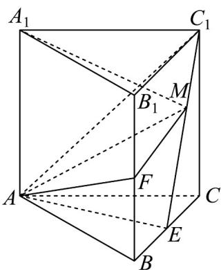

<!-- question-source:start -->
【变式2】如图，在直三棱柱 $ABC-A_{1}B_{1}C_{1}$ 中， $AC=BC=CC_{1}=2,AC\perp BC,E,F$ 分别为 $BC,BB_{1}$ 的中点.

(1)证明： $C_{1}E \perp$ 平面ACF；

(2)在线段 $EC_{1}$ 上是否存在点 $M$ ，使得直线 $A_{1}M$ 与平面 $AC_{1}E$ 所成角的正弦值为 $\frac{2}{21}\sqrt{14}$ ？若存在，求平面

AFM与平面 $AC_{1}E$ 夹角的余弦值；若不存在，请说明理由.
<!-- question-source:end -->

![[高中/课堂同步/题库/人教A版高中数学同步讲义(2026)/03_选择性必修第一册/第一章 空间向量与立体几何/讲义/第一章_空间向量与立体几何_高效培优讲义_/题型06_空间角的计算_sec_19/questions/answers/Q00062939A1.md]]
