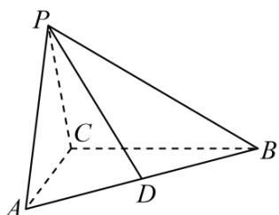

<!-- question-source:start -->
【变式3】如图，在三棱锥 $P - ABC$ 中， $AC = 2$ ， $BC = 4$ ， $\triangle PAC$ 为正三角形， $D$ 为 $AB$ 的中点，

$$
\angle P C B = \angle A C B = 9 0 ^ {\circ}
$$

(1)求证：平面 $PAC \perp$ 平面ABC；

(2)若 $O$ 为 $AC$ 的中点，求平面 $POD$ 与平面 $PBC$ 的夹角.
<!-- question-source:end -->

![[高中/课堂同步/题库/人教A版高中数学同步讲义(2026)/03_选择性必修第一册/第一章 空间向量与立体几何/讲义/第一章_空间向量与立体几何_高效培优讲义_/题型06_空间角的计算_sec_19/questions/answers/Q00062940A1.md]]
