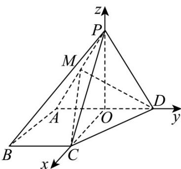

> [!faq]- 《第一章_空间向量与立体几何_高效培优讲义_》官方解析
>
> > [!success]- **【答案】** (1)证明见解析； (2) $\frac{3}{5}$ .
>
> > [!note]- **【解析】**
> > （1）设 $AD$ 中点为 $O$ ，连接 $PO$ ，因为 $\triangle PAD$ 为等边三角形，故 $PO \perp AD$
> >
> > 由题意，平面 $PAD \perp$ 平面 $ABCD$ ，平面 $PAD \cap$ 平面 $ABCD = AD$ ， $PO \subset$ 平面 $PAD$ ，
> >
> > 所以 $PO \perp$ 平面 $ABCD$ , $AB \subset$ 平面 $ABCD$ , 故 $PO \perp AB$
> >
> > 又 $PD \perp AB$ ， $PO \cap PD = P$ ， $PO, PD \subset$ 平面 $PAD$ ，故 $AB \perp$ 平面 $PAD$
> >
> > 由 $DM \subset$ 平面 PAD ，故 $AB \perp DM$
> >
> > 又 M 为 PA 的中点， $\triangle PAD$ 为等边三角形，则 $DM \perp PA$ ，
> >
> > 因为 $AB \cap PA = A$ ， $AB, PA \subset$ 平面 PAB，所以 $DM \perp$ 平面 PAB.
> >
> > (2)
> >
> > 
> >
> > 由（1）知 $AB \perp$ 平面 PAD ， $AD \subset$ 平面 PAD ，故 $AB \perp AD$ ，
> >
> > 连接 $CO$ ， $AO = \frac{1}{2} AD = 2$ ，则 $AO // BC, AO = BC$
> >
> > 即四边形 ABCO 为平行四边形，故 OC // AB ，所以 OC ⊥ AD ，
> >
> > 故以 O 为坐标原点，OC, OD, OP 所在直线分别为 x, y, z 轴，建立空间直角坐标系，
> >
> > 则 $P(0,0,2\sqrt{3}), B(2, -2,0), M(0, -1, \sqrt{3}), C(2,0,0), D(0,2,0)$
> >
> > $$
> > \stackrel {\square \square \square} {P B} = (2, - 2, - 2 \sqrt {3}), \stackrel {\square \square \square \square} {M C} = (2, 1, - \sqrt {3}), \stackrel {\square \square \square \square} {M D} = (0, 3, - \sqrt {3})
> > $$
> >
> > 设平面 $MCD$ 的法向量为 $n = (x,y,z)$ ，则 $\left\{ \begin{array}{l} n \cdot MC = 2x + y - \sqrt{3}z = 0 \\ n \cdot MD = 3y - \sqrt{3}z = 0 \end{array} \right.$ ，令 $y = 1$ ，则 $n = (1,1,\sqrt{3})$ ，
> >
> > 设直线 与平面 MCD 所成角为 $\theta$ ， $\theta \in [0, \frac{\pi}{2}]$ ，则 $\sin \theta = \left| \cos PB, n \right| = \left| \frac{PB \cdot n}{|PB||n|} \right| = \frac{6}{2\sqrt{5} \times \sqrt{5}} = \frac{3}{5}$ .
