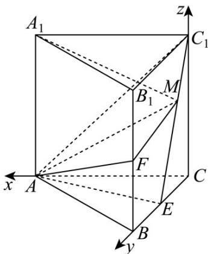

> [!faq]- 《第一章_空间向量与立体几何_高效培优讲义_》官方解析
>
> > [!success]- **【答案】** (1)证明见解析 $$ \frac {\sqrt {3 0}}{1 0} $$ (2)存在，10
>
> > [!note]- **【解析】**
> > （1）在直三棱柱 $ABC-A_{1}B_{1}C_{1}$ 中， $AC\perp BC$ ，则直线CA,CB, $CC_{1}$ 两两垂直，
> >
> > 以 C 为原点，直线 CA, CB, CC 分别为 x, y, z 轴建立空间直角坐标系，
> >
> > 
> >
> > 则 $A(2,0,0),B(0,2,0),C(0,0,0),A_{1}(2,0,2),B_{1}(0,2,2),C_{1}(0,0,2),E(0,1,0),F(0,2,1)$
> >
> > $$
> > C _ {1} E = (0, 1, - 2), A C = (- 2, 0, 0), A F = (- 2, 2, 1)
> > $$
> >
> > 于是 $C_{1}E \cdot AC = 0 \times (-2) + 1 \times 0 + (-2) \times 0 = 0$ ， $C_{1}E \perp AC$
> >
> > $$
> > C _ {1} E \cdot A F = 0 \times (- 2) + 1 \times 2 + (- 2) \times 1 = 0 \quad C _ {1} E \perp A F
> > $$
> >
> > 而 AC 和 AF 是平面 ACF 内两条相交直线，
> >
> > 所以 $C_{1}E \perp$ 平面 ACF.
> >
> > (2) 设点 M 存在， $EM = tEC_{1} = (0, -t, 2t)$ ， $M(0, 1 - t, 2t), t \in [0, 1]$
> >
> > $$
> > \stackrel {{\square \square \square}} {{A _ {1} M}} = (- 2, 1 - t, 2 t - 2), \stackrel {{\square \square \square}} {{A C _ {1}}} = (- 2, 0, 2), \stackrel {{\square \square \square}} {{A E}} = (- 2, 1, 0)
> > $$
> >
> > 设平面 $AC_{1}E$ 法向量为 $n = (x,y,z)$ ，则 $\left\{ \begin{array}{l} n \cdot AC_{1} = -2x + 2z = 0 \\ n \cdot AE = -2x + y = 0 \end{array} \right.$ ，
> >
> > 取 x=1 ，得 $n=(1,2,1)$
> >
> > 设 $A_{1}M$ 与平面 $AC_{1}E$ 所成角为 $\theta$ ， $\sin \theta = \frac{|A_M \cdot n|}{|A_1M||n|} = \frac{2}{\sqrt{4 + (1 - t)^2 + (2t - 2)^2} \cdot \sqrt{6}}$
> >
> > 由 $\frac{2}{\sqrt{4+(1-t)^{2}+(2t-2)^{2}}\cdot\sqrt{6}}=\frac{2}{21}\sqrt{14}$ ，解得 $t=\frac{1}{2}$ ，
> >
> > 即 $M$ 为 $EC_{1}$ 中点，坐标为 $(0, \frac{1}{2}, 1)$ ，
> >
> > $\overline{AM} = (-2, \frac{1}{2}, 1), \overline{AF} = (-2, 2, 1)$ ，设面 $AFM$ 法向量 $m = (a, b, c)$ ，
> >
> > 则 $\left\{ \begin{array}{l} \vec{\rightarrow} \quad \vec{\square} \quad \vec{\square} \\ m \cdot A M = -2a + \frac{1}{2}b + c = 0 \\ \vec{\rightarrow} \quad \vec{\square} \quad \vec{\square} \\ m \cdot A F = -2a + 2b + c = 0 \end{array} \right.$ ，取 $a = 1$ ，得 $m = (1,0,2)$ ，
> >
> > 设平面 $AFM$ 与平面 $AC_{1}E$ 的夹角为 $\beta$ ，则 $\cos \beta = \frac{|n:m|}{|n||m|} = \frac{1 + 0 + 2}{\sqrt{6}\times\sqrt{5}} = \frac{\sqrt{30}}{10}$
> >
> > 所以平面 AFM 与平面 $AC_{1}E$ 夹角的余弦值 $\frac{\sqrt{30}}{10}$
