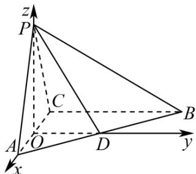

> [!faq]- 《第一章_空间向量与立体几何_高效培优讲义_》官方解析
>
> > [!success]- **【答案】** (1)证明见解析 (2) $\frac{\pi}{6}$
>
> > [!note]- **【解析】**
> > （1）因为 $\angle PCB = \angle ACB = 90^{\circ}$ ，所以 $PC \perp CB$ ， $AC \perp CB$ ，
> >
> > 又 $PC \cap AC = C$ ， $PC \subset$ 平面 $PAC$ ， $AC \subset$ 平面 $PAC$
> >
> > 所以 $BC \perp$ 平面 PAC ，
> >
> > 又 $BC \subset$ 平面 ABC ，所以平面 $PAC \perp$ 平面 ABC ；
> >
> > (2) 因为 $\triangle PAC$ 为正三角形，O 为 AC 中点，所以 $PO \perp AC$ ，
> >
> > 又平面 $PAC \perp$ 平面 $ABC$ ，平面 $PAC \cap$ 平面 $ABC = AC$ ， $PO \subset$ 平面 $PAC$
> >
> > 所以 $PO \perp$ 平面 ABC ，又 $OD \subset$ 平面 ABC ，所以 $PO \perp OD$
> >
> > 又 D 为 AB 的中点，所以 $OD \parallel BC$ ， $OD \perp AC$ ，
> >
> > 如图以 O 为原点建立空间直角坐标系，
> >
> > 
> >
> > 则 $P(0,0,\sqrt{3})$ ， $C(-1,0,0)$ ， $B(-1,4,0)$
> >
> > 所以 $\stackrel{\square\square\square\square}{PC}=\left(-1,0,-\sqrt{3}\right)$ ， $\stackrel{\square\square\square\square}{CB}=\left(0,4,0\right)$
> >
> > 设平面 $PBC$ 的法向量为 $m = (x, y, z)$
> >
> > 则 $\left\{\begin{aligned}&m\cdot P C=-x-\sqrt{3}z=0\\&m\cdot C B=4y=0\end{aligned}\right.$ ，令 $m=\left(\sqrt{3},0,-1\right)$ ，可得 $m=\left(\sqrt{3},0,-1\right)$ ，
> >
> > 又平面 $POD$ 的一个法向量可取 $n = (1,0,0)$
> >
> > 设平面 POD 与平面 PBC 夹角为 $\theta$
> >
> > 则 $\cos\theta=\left|\cos m,n\right|=\left|\frac{m:n}{|m||n|}\right|=\left|\frac{\sqrt{3}}{2\times1}\right|=\frac{\sqrt{3}}{2}$
> >
> > 又 $\theta \in \left[0, \frac{\pi}{2}\right]$ ，所以 $\theta = \frac{\pi}{6}$ ，即平面 $POD$ 与平面 $PBC$ 夹角为 $\frac{\pi}{6}$
