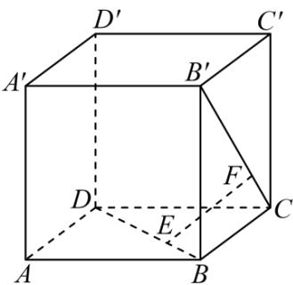
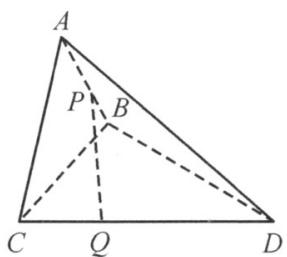
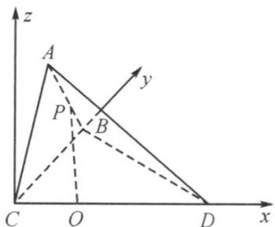

## 题型06 空间角的计算

【典例1】如图，在正方体 $ABCD - A'B'C'D'$ 中，点 $E$ 在 $BD$ 上，且 $BE = \frac{1}{3} BD$ ，点 $F$ 在 $CB'$ 上，且 $CF = \frac{1}{3} CB'$

(1)求证： $EF \parallel AC'$ ;

(2)求证： $EF \perp BD$ ， $EF \perp B^{\prime}C$ ；

(3)求异面直线 $FA$ 与 $BD$ 所成角的余弦值.

【答案】(1)证明见解析

(2)证明见解析

$$
\sqrt {7}
$$

(3) 14

【详解】（1）设正方体的棱长为3，以 $CD$ ， $CB$ ， $CC'$ 分别为 $x$ 轴、 $y$ 轴、 $z$ 轴正方向建立如图所示空间直

角坐标系，

则由题意可得 $E(1,2,0)$ ， $F(0,1,1)$ ， $A(3,3,0)$ ， $C'(0,0,3)$

所以 $EF = (-1, -1, 1)$ ， $AC' = (-3, -3, 3)$

所以 $AC' = 3EF$ ，即 $EF \parallel AC'$

(2) 由 (1) 得 $B(0,3,0)$ , $D(3,0,0)$ , $B'(0,3,3)$ , $EF = (-1,-1,1)$ ,

所以 $\overset{\square\square\square\square}{BD}=\left(3,-3,0\right)$ $\overset{\square\square\square\square\square}{B^{\prime}C}=\left(0,-3,-3\right)$

所以 $BD \cdot EF = 3 \times (-1) + (-3) \times (-1) + 0 \times 1 = 0$

$$
E F \cdot B ^ {\prime} C = 0 \times (- 1) + (- 3) \times (- 1) + (- 3) \times 1 = 0
$$

所以 $EF \perp BD$ ， $EF \perp B'C$

(3) 由 (1) (2) 得 $\overline{FA} = (3, 2, -1)$ , $\overline{BD} = (3, -3, 0)$

所以 $FA \cdot BD = 3 \times 3 + 2 \times (-3) + (-1) \times 0 = 3$

$$
\left| \stackrel {\text {WWW}} {F A} \right| = \sqrt {3 ^ {2} + 2 ^ {2} + (- 1) ^ {2}} = \sqrt {1 4}, \left| \stackrel {\text {WWW}} {B D} \right| = \sqrt {3 ^ {2} + (- 3) ^ {2} + 0 ^ {2}} = 3 \sqrt {2}
$$

设 FA 与 BD 所成角为 $\theta$ ，

则 $\cos\theta=\left|\frac{\square\square\square\cdot\square\square\square}{\left|\begin{matrix}F4\cdot BD\\ FA\end{matrix}\right|}\right|=\frac{3}{3\sqrt{2}\times\sqrt{14}}=\frac{\sqrt{7}}{14}$

【典例2】如图，在三棱锥 $A - BCD$ 中，平面 $ABC \perp$ 平面 $BCD$ ， $\triangle BAC$ 与 $\triangle BCD$ 均为等腰直角三角形，且

$$
\angle B A C = \angle B C D = 9 0 ^ {\circ} \quad B C = 2
$$

(1)求 $AD$ 与平面 $BCD$ 所成角的余弦值；

(2) $P$ 是线段 $AB$ 上的动点，若线段 $CD$ 上存在点 $Q$ （不包含端点），使得异面直线 $PQ$ 与 $AC$ 成 $30^{\circ}$ 角，求线段 $PA$ 长的取值范围．

$$
\frac {\sqrt {3 0}}{6}
$$

(2) $\left(0,\frac{\sqrt{6}}{3}\right)$

【详解】（1）因为 $\angle BCD = 90^{\circ}$ ，所以 $BC \perp CD$ ，

又平面 $ABC \perp$ 平面 BCD ，交线为 BC ， $CD \subset$ 平面 BCD ，所以 $CD \perp$ 平面 ABC ，

又 $BC, AC \subset$ 平面 $ABC$ ，所以 $CD_{\perp}BC$ ， $CD_{\perp}AC$

以 C 为原点、 CD 为 x 轴、 CB 为 y 轴、平面 ABC 上过点 C 的 BC 的垂线为 z 轴建立空间直角坐标系，如图， $\triangle BAC$ 与 $\triangle BCD$ 均为等腰直角三角形，BC=2，则 $C(0,0,0)$ ， $A(0,1,1)$ ， $D(2,0,0)$

平面 $BCD$ 的法向量为 $m = (0,0,1)$

设 $AD$ 与平面 $BCD$ 所成的角为 $\theta$ ， $\overline{DA} = (-2,1,1)$

$$
\sin \theta = \frac {\left| \overrightarrow {D A} \cdot m \right|}{\left| \overrightarrow {D A} \right| \cdot | m |} = \frac {\left| (- 2 , 1 , 1) \cdot (0 , 0 , 1) \right|}{\sqrt {4 + 1 + 1}} = \frac {\sqrt {6}}{6},
$$

故 $\cos \theta = \sqrt{1 - \sin^2\theta} = \frac{\sqrt{30}}{6}$

(2) $B(0,2,0)$ ，设 $Q(\mu,0,0)$ ， $0 < \mu < 2$ 。设 $AP = \lambda AB = (0,\lambda, -\lambda)$ ，其中 $0 < \lambda \leq 1$ ，

但当 $\lambda = 0$ 时， $A, P$ 两点重合，此时 $PQ$ 与 $AC$ 不是异面直线，故 $\lambda \neq 0$ ，所以 $0 < \lambda \leq 1$

则 $PQ = CQ - CP = CQ - (CA + AP) = (\mu, -1 - \lambda, \lambda - 1)$

由 $\cos30^{\circ}=\frac{\left|\begin{matrix}\square\square\square\\CA\cdot PQ\\ \square\square\square\end{matrix}\right|}{\left|\begin{matrix}CA\end{matrix}\right|\left|\begin{matrix}PQ\end{matrix}\right|}=\frac{2}{\sqrt{2}\times\sqrt{\mu^{2}+2\lambda^{2}+2}}=\frac{\sqrt{3}}{2}$ ，得 $\mu^{2}+2\lambda^{2}+2=\frac{8}{3}$ ，

其中 $0 < \mu < 2$ ，即 $\frac{2}{3} - 2\lambda^2 \in (0,4)$ ，解得 $\lambda^2 \in \left[0, \frac{1}{3}\right)$

又 $0 < \lambda \leq 1$ ，所以 $\lambda \in \left(0, \frac{\sqrt{3}}{3}\right)$

故 $\left|\overrightarrow{AP}\right| = \sqrt{2}\lambda \in \left(0,\frac{\sqrt{6}}{3}\right)$

## 方法技巧

异面直线所成的角：已知 $a, b$ 为两异面直线， $A, C$ 与 $B, D$ 分别是 $a, b$ 上的任意两点， $a, b$ 所成的角为 $\theta$

则 $\cos \theta = \frac{\left|\overline{AC} \cdot \overline{BD}\right|}{\left|AC\right| \cdot \left|BD\right|}$

线面角：设直线 $l$ 的方向向量为 $a$ ，平面 $\alpha$ 的法向量为 $u$ ，直线与平面所成的角为 $\theta$ ， $a$ 与 $u$ 的角为 $\varphi$ ，则有

$$
\sin \theta = | \cos \varphi | = \frac {| \underset {\rightarrow} {a} \cdot u |}{| a | \cdot | u |}
$$

二面角：如图，若 $PA \perp \alpha$ 于 $A, PB \perp \beta$ 于 $B$ ，平面 $PAB$ 交 $l$ 于 $E$ ，则 $\angle AEB$ 为二面角 $\alpha - l - \beta$ 的平面角， $\angle AEB + \angle APB = 180^{\circ}$

若 $n_1, n_2$ 分别为面 $\alpha, \beta$ 的法向量， $\cos \left\langle n_1, n_2 \right\rangle = \frac{n_1 \cdot n_2}{|n_1| \cdot |n_2|}$ 则二面角的平面角 $\angle AEB = \left\langle n_1, n_2 \right\rangle$ 或 $\pi - \left\langle n_1, n_2 \right\rangle$

![[高中/课堂同步/题库/人教A版高中数学同步讲义(2026)/03_选择性必修第一册/第一章 空间向量与立体几何/讲义/第一章_空间向量与立体几何_高效培优讲义_/题型06_空间角的计算_sec_19/questions/Q00062938.md]]
![[高中/课堂同步/题库/人教A版高中数学同步讲义(2026)/03_选择性必修第一册/第一章 空间向量与立体几何/讲义/第一章_空间向量与立体几何_高效培优讲义_/题型06_空间角的计算_sec_19/questions/Q00062939.md]]
![[高中/课堂同步/题库/人教A版高中数学同步讲义(2026)/03_选择性必修第一册/第一章 空间向量与立体几何/讲义/第一章_空间向量与立体几何_高效培优讲义_/题型06_空间角的计算_sec_19/questions/Q00062940.md]]
