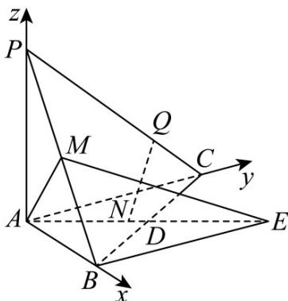

> [!faq]- 《第一章_空间向量与立体几何_高效培优讲义_》官方解析
>
> > [!success]- **【答案】** (1)证明见解析 (2) $\frac{\sqrt{10}}{5}$ (3) $\frac{2\sqrt{10}}{5}$
>
> > [!note]- **【解析】**
> > （1）因为 $AC = 2$ ， $AB = 2\sqrt{2}$ ， $AD = \sqrt{3}$ ， $D$ 是 $BC$ 的中点，所以 $2\overline{A} D = \overline{A} B + \overline{A} C$ ，两边平方，得 $4\left|\overline{A} D\right|^2 = \left|\overline{A} B\right|^2 +\left|\overline{A} C\right|^2 +2\overline{A} B\cdot \overline{A} C$
> >
> > 即 $12 = 8 + 4 + 2AB\cdot AC$ ，得 $AB\cdot AC = 0$
> >
> > 所以 $AB \perp AC$ .
> >
> > 
> >
> > 又 $AP \perp$ 平面 ABC ，所以 AB ，AC ，AP 两两垂直，
> >
> > 如图，以A为原点，AB，AC，AP所在的直线分别为x轴、y轴、z轴建立空间直角坐标系，则 $A(0,0,0)$ ， $B(2\sqrt{2},0,0)$ ， $C(0,2,0)$ ， $P(0,0,2)$ ， $E(2\sqrt{2},2,0)$ ， $M(\sqrt{2},0,1)$ 。
> >
> > 所以， $\overline{BC}=\left(-2\sqrt{2},2,0\right),\overline{ME}=\left(\sqrt{2},2,-1\right)$
> >
> > 所以 $ME \cdot BC = \sqrt{2} \times (-2\sqrt{2}) + 2 \times 2 + (-1) \times 0 = 0$
> >
> > 所以 $ME \perp BC$ .
> >
> > (2) 由题意，知平面 $AMB$ 的一个法向量是 $m = (0,1,0)$ .
> >
> > 易得 $\overline{AE}=\left(2\sqrt{2},2,0\right)$ ， $\overline{AM}=\left(\sqrt{2},0,1\right)$ .
> >
> > 设平面 $_{AME}$ 的法向量是 $n = (x, y, z)$ ，则 $\begin{cases} n \cdot AE = 0, \\ n \cdot AM = 0, \end{cases}$ 即 $\begin{cases} 2\sqrt{2}x + 2y = 0, \\ \sqrt{2}x + z = 0, \end{cases}$
> >
> > 令 $x = 1$ ，得 $y = z = -\sqrt{2}$ ，所以平面AME的一个法向量是 $n = (1, - \sqrt{2}, - \sqrt{2})$
> >
> > 所以 $\cos\langle\overrightarrow{m},n\rangle=\frac{-\sqrt{2}}{1\times\sqrt{5}}=-\frac{\sqrt{10}}{5}$
> >
> > 由图，知二面角 $B - AM - E$ 为锐角，所以二面角 $B - AM - E$ 的余弦值为 $\frac{\sqrt{10}}{5}$
> >
> > (3) 因为点 N, Q 分别是直线 AE, PC 上的动点,
> >
> > $$
> > \text {设} A N = k A E (k \in \mathbf {R}), N \left(x _ {N}, y _ {N}, z _ {N}\right) \text {, 则} \left(x _ {N}, y _ {N}, z _ {N}\right) = k (2 \sqrt {2}, 2, 0), \text {所以} N (2 \sqrt {2} k, 2 k, 0).
> > $$
> >
> > 设 $PQ = tPC(t \in \mathbf{R})$ ， $Q(x_{Q}, y_{Q}, z_{Q})$ ，则 $(x_{Q}, y_{Q}, z_{Q} - 2) = t(0, 2, -2)$ ，所以 $Q(0, 2t, 2 - 2t)$
> >
> > $$
> > N Q ^ {2} = (2 \sqrt {2} k) ^ {2} + (2 k - 2 t) ^ {2} + (2 t - 2) ^ {2} = 1 2 k ^ {2} - 8 k t + 8 t ^ {2} - 8 t + 4 = 1 2 \left(k - \frac {t}{3}\right) ^ {2} + \frac {2 0}{3} \left(t - \frac {3}{5}\right) ^ {2} + \frac {8}{5}
> > $$
> >
> > 所以当 $k=\frac{1}{5}$ ， $t=\frac{3}{5}$ 时，NQ 取得最小值，为 $\frac{2\sqrt{10}}{5}$
