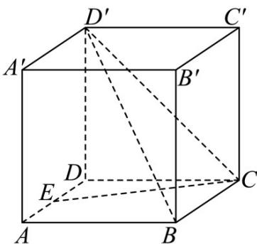

## 题型07 空间距离的计算

【典例1】如图，已知正方体 $ABCD - A'B'C'D'$ 的棱长为2，点 $E$ 是棱 $AD$ 的中点.

(1)求直线 CE 与直线 $B^{\prime}C^{\prime}$ 所成角的余弦值；

(2)求直线 $B^{\prime}C^{\prime}$ 到平面 $BCD^{\prime}$ 的距离.

【答案】(1) $\frac{\sqrt{5}}{5}$

(2) $\sqrt{2}$

【详解】（1）以 $D$ 为原点，分别以 $DA, DC, DD'$ 所在直线为 $x, y, z$ 轴，建立如图所示的空间直角坐标系，则 $C(0,2,0)$ $E(1,0,0)$ $B'(2,2,2)$ $C'(0,2,2)$

所以 $\overrightarrow{CE} = (1, -2, 0)$ ， $\overrightarrow{B'C'} = (-2, 0, 0)$ ，所以 $\left|\cos\left\langle\overrightarrow{CE}, B'C'\right\rangle\right| = \frac{\left|\overrightarrow{CE} \cdot B'C'\right|}{\left|CE\right| \cdot \left|B'C'\right|} = \frac{2}{\sqrt{5} \times 2} = \frac{\sqrt{5}}{5}$

即直线 CE 与直线 $B^{\prime}C^{\prime}$ 所成角的余弦值为 $\frac{\sqrt{5}}{5}$ .

(2) 由于 $B^{\prime}C^{\prime}\parallel BC$ ， $BC \subset \text{平面 } BCD^{\prime}$ ， $B^{\prime}C^{\prime} \notin \text{平面 } BCD^{\prime}$ ，故 $B^{\prime}C^{\prime} // \text{平面 } BCD^{\prime}$

因此直线 $B^{\prime}C^{\prime}$ 到平面 $BCD^{\prime}$ 的距离与点 $B^{\prime}$ 到平面 $BCD^{\prime}$ 的距离相等.

$D^{\prime}(0,0,2)$ $B(2,2,0)$ $\overline{BC} = \overline{B'C'} = (-2,0,0)$ $\overline{BD'} = (-2,-2,2)$

设平面 $BCD'$ 的法向量为 $m = (x, y, z)$ ，则 $m \cdot BC = -2x = 0$ ，且 $m \cdot BD' = -2x - 2y + 2z = 0$ ，

令 $y = 1$ ，则 $m = (0,1,1)$ .

又 $BB' = (0, 0, 2)$ ，故 $B'$ 到平面 $BCD'$ 的距离为 $\frac{\left|\overrightarrow{BB'} \cdot m\right|}{\left|m\right|} = \frac{2}{\sqrt{2}} = \sqrt{2}$

因此直线 $B^{\prime}C^{\prime}$ 到平面 $BCD^{\prime}$ 的距离为 $\sqrt{2}$ .

【典例2】如图所示，在直三棱柱 $ABC - A_{1}B_{1}C_{1}$ 中， $\angle ABC = 90^{\circ},BC = 2,CC_{1} = 4$ ，点 $E$ 在线段 $BB_{1}$ 上，且

$EB_{1} = 1$ ， $D$ 、 $F$ 、 $G$ 分别为 $CC_{1}, C_{1}B_{1}, C_{1}A_{1}$ 的中点.

(1)求证： $B_{1}D \perp$ 平面ABD；

(2)求证：平面 $EGF//$ 平面ABD；

(3)求平面 $EGF$ 与平面 $ABD$ 的距离.

【答案】(1)证明见解析；

(2)证明见解析；

$$
3 \sqrt {2}
$$

(3) 2.

【详解】（1）由题设， $BA,BC,BB_{1}$ 两两互相垂直，

以 $B$ 为坐标原点， $BA, BC, BB_{1}$ 分别为 $x$ 轴、 $y$ 轴、 $z$ 轴建立空间直角坐标系，如图所示，

则 $B(0,0,0)$ , $D(0,2,2)$ , $B_{1}(0,0,4)$ ，设 BA = a，则 $A(a,0,0)$ .

所以 $\overline{BA}=(a,0,0),\overline{BD}=(0,2,2),\overline{B_{1}D}=(0,2,-2)$ ，易得 $\overline{B_{1}D}\cdot\overline{BA}=0,\quad\overline{B_{1}D}\cdot\overline{BD}=0$

所以 $\stackrel{\square\square\square\square}{B_{1}D}\perp\stackrel{\square\square\square}{BA},\quad\stackrel{\square\square\square\square}{B_{1}D}\perp\stackrel{\square\square\square}{BD}$ ，所以 $B_{1}D\perp BA,\quad B_{1}D\perp BD$

又 $BA \cap BD = B$ ，且 $BA, BD$ 都在平面 $ABD$ 内，故 $B_{1}D \perp$ 平面 $ABD$ .

(2) 由题意知 $E(0,0,3), G(\frac{a}{2},1,4), F(0,1,4)$ ，则 $EG = (\frac{a}{2},1,1), EF = (0,1,1)$

所以 $B_{1}D \cdot EG = 0$ ， $B_{1}D \cdot EF = 0$ ，则 $B_{1}D \perp EG$ ， $B_{1}D \perp EF$

所以 $B_{1}D \perp EG$ ， $B_{1}D \perp EF$

又 $EG \cap EF = E$ 且 $B_{1}D, EF$ 都在平面 $EFG$ 内，所以 $B_{1}D \perp$ 平面 $EFG$

结合（1）知，平面 $EGF / /$ 平面ABD.

(3) 由 (1) (2) 知， $\overline{BF}=(0,1,4)$ ， $\overline{B_{1}D}=(0,2,-2)$ 是平面 ABD 的法向量，

所以点 $F$ 到平面 $ABD$ 的距离为 $d = \frac{\left|\overrightarrow{BF} \cdot \overrightarrow{B_1 D}\right|}{\left|\overrightarrow{B_1 D}\right|} = \frac{6}{\sqrt{8}} = \frac{3\sqrt{2}}{2}$

由（2）知，平面 $EGF$ 与平面 $ABD$ 的距离等于点 $F$ 到平面 $ABD$ 的距离，

所以两平面间的距离为 $\frac{3\sqrt{2}}{2}$ .

## 方法技巧

1. 求点面距的一般步骤：

①求出该平面的一个法向量；

②找出从该点出发的平面的任一条斜线段对应的向量；

③求出法向量与斜线段向量的数量积的绝对值再除以法向量的模，即可求出点到平面的距离。

即：点 $A$ 到平面 $\alpha$ 的距离 $d = \frac{\left|AB\cdot n\right|}{|n|}$ ，其中 $B \in \alpha$ ， $n$ 是平面 $\alpha$ 的法向量。

2. 设直线 $l$ 的单位方向向量为 $u, A \in l, P \notin l$ , 设 $AP = a$ , 则点 $P$ 到直线 $l$ 的距离 $d = \sqrt{\left|a\right|^2 - (a \cdot u)^2}$

![[高中/课堂同步/题库/人教A版高中数学同步讲义(2026)/03_选择性必修第一册/第一章 空间向量与立体几何/讲义/第一章_空间向量与立体几何_高效培优讲义_/题型07_空间距离的计算_sec_20/questions/Q00062941.md]]
![[高中/课堂同步/题库/人教A版高中数学同步讲义(2026)/03_选择性必修第一册/第一章 空间向量与立体几何/讲义/第一章_空间向量与立体几何_高效培优讲义_/题型07_空间距离的计算_sec_20/questions/Q00062942.md]]
![[高中/课堂同步/题库/人教A版高中数学同步讲义(2026)/03_选择性必修第一册/第一章 空间向量与立体几何/讲义/第一章_空间向量与立体几何_高效培优讲义_/题型07_空间距离的计算_sec_20/questions/Q00062943.md]]
