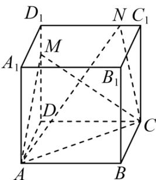

<!-- question-source:start -->
【变式3】如图，四棱柱 $ABCD - A_{1}B_{1}C_{1}D_{1}$ 的棱长均为6，侧棱与底面垂直，且 $\angle BAD = 60^{\circ}$ ， $M$ 是侧棱 $DD_{1}$

上的点， $DM = 2MD_{1}$ ， $N$ 是线段 $C_1D_1$ 上的动点.

(1)以 $D$ 为坐标原点、 $\overline{DC}$ 为 $y$ 轴正方向、 $\overline{DD_1}$ 为 $z$ 轴正方向，建立空间直角坐标系，写出点 $B_{1}$ 的坐标.

(2)求点 $B_{1}$ 到平面ACM的距离.

(3)在线段 $D_{1}C_{1}$ 上是否存在一点 $N$ ，使得平面 $ACM$ 与平面 $ACN$ 夹角的余弦值为 $\frac{3\sqrt{10}}{10}$ ? 若存在，求出点 $N$ 的位

置；若不存在，请说明理由。
<!-- question-source:end -->

![[高中/课堂同步/题库/人教A版高中数学同步讲义(2026)/03_选择性必修第一册/第一章 空间向量与立体几何/讲义/第一章_空间向量与立体几何_高效培优讲义_/题型08_空间向量与立体几何的综合问题_sec_21/questions/answers/Q00062946A1.md]]
