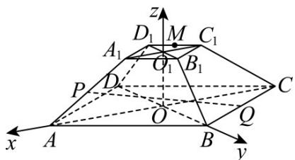
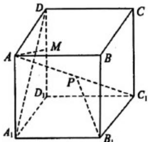
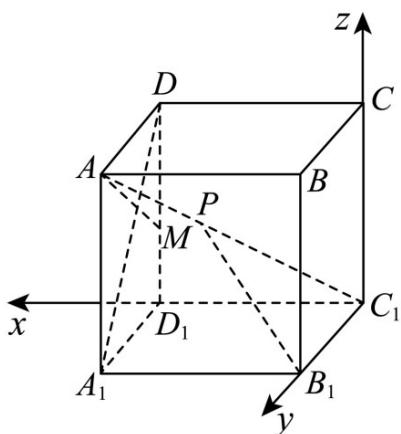

## 题型08 空间向量与立体几何的综合问题

【典例1】如图，正四棱台 $ABCD - A_{1}B_{1}C_{1}D_{1}$ 中， $AB = 3$ ， $A_{1}B_{1} = 1$ ， $AA_{1} = 2$ ， $M$ 是 $C_1D_1$ 的中点，在直线

$AA_{1}, BC$ 上各取一个点 $^{P}$ ， $Q$ ，使得 $M, P, Q$ 三点共线，则线段 $^{PQ}$ 的长度为（）

A.3 B. $\sqrt{15}$ C. $\frac{27}{5}$ D.4

## 【答案】C

【详解】连接 $AC, BD$ 交于点 $O$ ，连接 $A_{1}C_{1}, B_{1}D_{1}$ 交于点 $O_{1}$ ，连接 $OO_{1}$ ，由正四棱台的结构特征， $AC, BD, OO_{1}$ 两两垂直，故以 $OA, OB, OO_{1}$ 所在直线分别为 $x, y, z$ 轴建立如图所示的空间直角坐标系。因为在正四棱台 $ABCD - A_{1}B_{1}C_{1}D_{1}$ 中， $AB = 3$ ， $A_{1}B_{1} = 1$ ， $AA_{1} = 2$ ，所以 $OA = OB = \frac{3\sqrt{2}}{2}$ ， $OO_{1} = \sqrt{2}$ ，所以 $A\left(\frac{3\sqrt{2}}{2}, 0, 0\right)$ ， $B\left(0, \frac{3\sqrt{2}}{2}, 0\right)$ ， $A_{1}\left(\frac{\sqrt{2}}{2}, 0, \sqrt{2}\right)$ ， $C_{1}\left(-\frac{\sqrt{2}}{2}, 0, \sqrt{2}\right)$ ， $D_{1}\left(0, -\frac{\sqrt{2}}{2}, \sqrt{2}\right)$ ， $C\left(-\frac{3\sqrt{2}}{2}, 0, 0\right)$ ，因为 $M$ 是 $C_{1}D_{1}$ 的中点，所以 $M\left(-\frac{\sqrt{2}}{4}, -\frac{\sqrt{2}}{4}, \sqrt{2}\right)$ ，设 $A_{1}P = \lambda A_{1}A$ ， $BQ = \mu BC$ ，所以 $\overrightarrow{MP} = \overrightarrow{MA}_{1} + \overrightarrow{\lambda A_{1}A} = \left(\frac{3\sqrt{2}}{4}, \frac{\sqrt{2}}{4}, 0\right) + \lambda (\sqrt{2}, 0, -\sqrt{2}) = \left(\frac{3\sqrt{2}}{4} + \sqrt{2}\lambda, \frac{\sqrt{2}}{4}, -\sqrt{2}\lambda\right)$ ， $\overrightarrow{MQ} = \overrightarrow{MB} + \overrightarrow{\mu BC} = \left(\frac{\sqrt{2}}{4}, \frac{7\sqrt{2}}{4}, -\sqrt{2}\right) + \mu \left(-\frac{3\sqrt{2}}{2}, -\frac{3\sqrt{2}}{2}, 0\right) = \left(\frac{\sqrt{2}}{4} - \frac{3\sqrt{2}}{2}\mu, \frac{7\sqrt{2}}{4} - \frac{3\sqrt{2}}{2}\mu, -\sqrt{2}\right)$ 。要使 $M, P, Q$ 三点共线，则 $\overrightarrow{MP}, \overrightarrow{MQ}$ 共线，即存在 $m$ ，使得 $\overrightarrow{MP} = mMQ$ 。

则

$$
\left\{ \begin{array}{c} {\frac {3 \sqrt {2}}{4} + \sqrt {2} \lambda = m \left(\frac {\sqrt {2}}{4} - \frac {3 \sqrt {2}}{2} \mu\right),} \\ {\frac {\sqrt {2}}{4} = m \left(\frac {7 \sqrt {2}}{4} - \frac {3 \sqrt {2}}{2} \mu\right),} \\ {- \sqrt {2} \lambda = - \sqrt {2} m,} \end{array} \text {解得} \left\{ \begin{array}{l l} {\lambda = - \frac {1}{5},} \\ {\mu = 2,} \\ {m = - \frac {1}{5},} \end{array} \right. \right.
$$

$$
\text {所以} \stackrel {\square \square \square} {M P} = \left(\frac {1 1 \sqrt {2}}{2 0}, \frac {\sqrt {2}}{4}, \frac {\sqrt {2}}{5}\right), \quad \stackrel {\square \square \square} {M Q} = \left(- \frac {1 1 \sqrt {2}}{4}, - \frac {5 \sqrt {2}}{4}, - \sqrt {2}\right),
$$

所以 $PQ = MQ - MP = \left(-\frac{33\sqrt{2}}{10}, -\frac{3\sqrt{2}}{2}, -\frac{6\sqrt{2}}{5}\right)$ ,

所以 $\left|PQ\right|=\sqrt{\left(\frac{-33\sqrt{2}}{10}\right)^{2}+\left(-\frac{3\sqrt{2}}{2}\right)^{2}+\left(-\frac{6\sqrt{2}}{5}\right)^{2}}=\frac{27}{5}$

故选：C.

【典例2】如图， $P$ 是正方体 $ABCD - A_{1}B_{1}C_{1}D_{1}$ 体对角线 $AC_{1}$ （含端点）上的动点， $M$ 为棱 $DD_{1}$ （含端点）上

的动点，则下列说法正确的是（）

A. 异面直线 $B_{1}P$ 与 $A_{1}D$ 所成角的最小值为 $\frac{\pi}{4}$ B. 异面直线 $B_{1}P$ 与 $A_{1}D$ 所成角的最大值为 $\frac{\pi}{2}$ C. 对于任意给定的 $P$ ，存在点 $M$ ，使得 $AM \perp B_{1}P$ D. 对于任意给定的 $M$ ，存在点 $P$ ，使得 $B_{1}P \perp AM$

【答案】D

【详解】以 $C_1$ 为坐标原点，建系如图，设正方体的边长为1，则 $A_{1}D = (0, - 1,1)$ 设 $\overline{C_1P} = \lambda \overline{C_1A} = (\lambda ,\lambda ,\lambda)$ ， $\lambda \in [0,1]$ ，则 $B_{1}P = B_{1}C_{1} + C_{1}P = (\lambda ,\lambda -1,\lambda)$

设异面直线 $B_{1}P$ 与 $A_{1}D$ 所成的角为 $\theta$ ，

则 $\cos\theta=\left|\cos B_{1}P,A_{1}D\right|=\frac{1}{\sqrt{2}\cdot\sqrt{\lambda^{2}+\left(1-\lambda\right)^{2}+\lambda^{2}}}=\frac{1}{\sqrt{2}\cdot\sqrt{3\lambda^{2}-2\lambda+1}}$

因 $y = 3\lambda^2 - 2\lambda + 1 = 3\left(\lambda - \frac{1}{3}\right)^2 + \frac{2}{3}$ ，由于 $\lambda = \frac{1}{3} \in [0,1]$ ，则 $\lambda = \frac{1}{3}$ 时， $y_{\min} = \frac{2}{3}$ ，

又 $\lambda = 0\Rightarrow y = 1$ ， $\lambda = 1\Rightarrow y = 2$ ，于是 $y\in \left[\frac{2}{3},2\right]$ ，则 $\cos \theta \in \left[\frac{\sqrt{3}}{2},\frac{1}{2}\right]$

又 $\theta \in \left(0, \frac{\pi}{2}\right]$ ，结合余弦函数的单调性可知， $\theta \in \left[\frac{\pi}{6}, \frac{\pi}{3}\right]$ ，故AB错误；

对于C.设 $M(1,0,m)$ ， $m\in [0,1]$ ，则 $\overline{AM} = (0, - 1,m - 1)$

由上述分析， $B_{1}P=\left(\lambda,\lambda-1,\lambda\right)$ ， $AM\cdot B_{1}P=1-\lambda+\lambda(m-1)=1+\lambda(m-2)$

当 $\lambda = 0$ 时， $AM\cdot B_1P = 0$ 无解，故C错误；

对于D. $\forall m\in [0,1]$ ，令 $AM\cdot B_1P = 0$ ，得 $\lambda = \frac{1}{2 - m}\in \left[\frac{1}{2},1\right]\subseteq [0,1]$

即对于任意的 M，存在点 P 使得 $AM \perp B_{1}P$ ，故 D 正确.

故选：D.

![[高中/课堂同步/题库/人教A版高中数学同步讲义(2026)/03_选择性必修第一册/第一章 空间向量与立体几何/讲义/第一章_空间向量与立体几何_高效培优讲义_/题型08_空间向量与立体几何的综合问题_sec_21/questions/Q00062944.md]]
![[高中/课堂同步/题库/人教A版高中数学同步讲义(2026)/03_选择性必修第一册/第一章 空间向量与立体几何/讲义/第一章_空间向量与立体几何_高效培优讲义_/题型08_空间向量与立体几何的综合问题_sec_21/questions/Q00062945.md]]
![[高中/课堂同步/题库/人教A版高中数学同步讲义(2026)/03_选择性必修第一册/第一章 空间向量与立体几何/讲义/第一章_空间向量与立体几何_高效培优讲义_/题型08_空间向量与立体几何的综合问题_sec_21/questions/Q00062946.md]]
