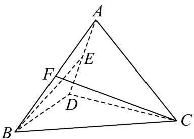

<!-- question-source:start -->
4．如图，在四面体ABCD中， $\triangle ADB$ 与 $^{\triangle}ADC$ 为等边三角形，且 $BD \perp DC$ ， $E$ ， $F$ 分别为棱 $AD$ ， $AB$ 的

中点，则异面直线 BE，CF 所成角的余弦值为（）

A. $\frac{\sqrt{15}}{6}$ B. $\frac{\sqrt{15}}{3}$ C. $\frac{\sqrt{5}}{6}$ D. $\frac{\sqrt{5}}{3}$
<!-- question-source:end -->

![[高中/课堂同步/题库/人教A版高中数学同步讲义(2026)/03_选择性必修第一册/第一章 空间向量与立体几何/阶段测试/第一章_空间向量与立体几何_高效培优单元测试_强化卷_/一_选择题_sec_02/questions/answers/Q00062893A1.md]]
