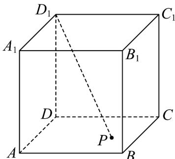

<!-- question-source:start -->
9．如图，已知正方体 $ABCD - A_1B_1C_1D_1$ 的棱长为2， $P$ 是正方形 $ABCD$ （包括边界）底面内的一动点，则

下列结论正确的有（）

A. 三棱锥 $B_{1} - A_{1}D_{1}P$ 的体积为定值

B．存在点P，使得 $D_{1}P\perp BC_{1}$

C．若 $D_{1}P \perp B_{1}D$ ，则 $P$ 点在正方形ABCD内的运动轨迹长度为 $2\sqrt{2}$

D．若点 P 为 AD 的中点，点 Q 为 $BB_{1}$ 的中点，过 P，Q 作平面 $\alpha \perp$ 平面 $ACC_{1}A_{1}$ ，则平面 $\alpha$ 截正方体

$ABCD-A_{1}B_{1}C_{1}D_{1}$ 所得截面的面积为 $3\sqrt{3}$
<!-- question-source:end -->

![[高中/课堂同步/题库/人教A版高中数学同步讲义(2026)/03_选择性必修第一册/第一章 空间向量与立体几何/阶段测试/第一章_空间向量与立体几何_高效培优单元测试_强化卷_/一_选择题_sec_02/questions/answers/Q00062898A1.md]]
