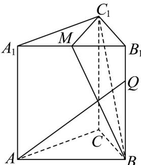

<!-- question-source:start -->
11. 如图，在正三棱柱 $ABC - A_{1}B_{1}C_{1}$ 中， $AB = AA_{1} = 2$ 点 $M$ 为 $A_{1}B_{1}$ 的中点，点 $Q$ 在棱 $BB_{1}$ 上，则下列说

法正确的是（）

A $C_1M\perp AQ$

B．当点Q为 $BB_{1}$ 的中点时，点P为上底面 $A_{1}B_{1}C_{1}$ 内的动点(包括边界)，若 $PQ//$ 平面 $MBC_{1}$ ，则点P的

轨迹长度为 $\frac{\sqrt{3}}{2}$

C. 当点 $Q$ 为靠近 $B_{1}$ 的四等分点时， $AQ$ 与 $BC_{1}$ 夹角的余弦值为 $\frac{\sqrt{2}}{5}$

D．当点Q为 $BB_{1}$ 的中点时，将线段QA绕QB旋转 $90^{\circ}$ 到 $QA'$ ，则QA在旋转过程中(包含QA与 $QA'$ )与

平面 $MBC_{1}$ 所成角的正弦值的取值范围为 $\left[\frac{1}{5},1\right]$
<!-- question-source:end -->

![[高中/课堂同步/题库/人教A版高中数学同步讲义(2026)/03_选择性必修第一册/第一章 空间向量与立体几何/阶段测试/第一章_空间向量与立体几何_高效培优单元测试_强化卷_/一_选择题_sec_02/questions/answers/Q00062900A1.md]]
