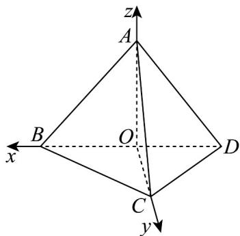

> [!faq]- 《第一章_空间向量与立体几何_高效培优单元测试_强化卷_》官方解析
>
> > [!success]- **【答案】** B
>
> > [!note]- **【分析】**
> > 建立合适的空间直角坐标系，求出 $AB, CD$ ，根据异面直线夹角公式即可得到答案·
>
> > [!note]- **【解析】**
> > 取 $BD$ 的中点 $O$ ，连接 $AO$ ， $OC$ ，由 $CA = CB = CD = BD = 2$ ， $AB = AD = \sqrt{2}$ ，得 $AO \perp BD, CO \perp BD$ 且 $OC = \sqrt{3}, AO = 1$ ，在 $\triangle AOC$ 中， $AC^2 = AO^2 + OC^2$ ，故 $AO \perp OC$ ，
> > 又 $BD \cap OC = O$ ， $BD, OC \subset$ 平面 $BCD$ ，所以 $AO \perp$ 平面 $BCD$ ，
> > 以 $OB$ ， $OC$ ， $OA$ 所在直线分别为 $x$ 轴、 $y$ 轴、 $z$ 轴建立空间直角坐标系，
> > 如图所示，则 $A(0,0,1), B(1,0,0), C(0,\sqrt{3},0), D(-1,0,0)$ ，
> > 所以 $AB = (1,0,-1), CD = (-1,-\sqrt{3},0)$ ，
> > 设异面直线 $AB$ 与 $CD$ 所成角为 $\theta$ ，则 $\cos \theta = \frac{|AB \cdot CD|}{|AB||CD|} = \frac{1}{\sqrt{2} \times \sqrt{1+3}} = \frac{\sqrt{2}}{4}$ ，
> > 即异面直线 $AB$ 与 $CD$ 所成角的余弦值为 $\frac{\sqrt{2}}{4}$ ·
> >
> > 故选：B.
> >
> > 
