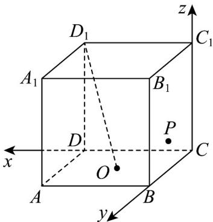
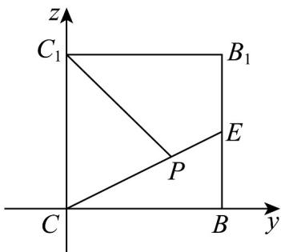

> [!faq]- 《第一章_空间向量与立体几何_高效培优单元测试_强化卷_》官方解析
>
> > [!success]- **【答案】** D
>
> > [!note]- **【分析】**
> > 通过建立空间直角坐标系，设 P 坐标，根据 $D_{1}O \perp OP$ 可得出轨迹方程，再根据轨迹方程即可求
> >
> > 解·
>
> > [!note]- **【解析】**
> > 如图，以 $C$ 为原点建立空间直角坐标系，设 $P(0,y,z)$
> >
> > 
> >
> > $O(1,1,0)$
> >
> > $$
> > D _ {1} O = (- 1, 1, - 2)
> > $$
> >
> > $$
> > O P = (- 1, y - 1, z)
> > $$
> >
> > $$
> > \begin{array}{l} D _ {1} O \perp O P \\ \therefore \end{array} , \therefore \begin{array}{l} D _ {1} O \cdot O P = (- 1, 1, - 2) \cdot (- 1, y - 1, z) = y - 2 z = 0 \end{array}
> > $$
> >
> > ∴点 P 在侧面 $BB_{1}C_{1}C$ 的边界及其内部运动的轨迹如图线段 CE :
> >
> > 
> >
> > 正方体 $ABCD - A_{1}B_{1}C_{1}D_{1}$ 中， $C_{1}D_{1} \perp$ 平面 $BB_{1}C_{1}C$
> >
> > $\therefore C_{1}D_{1}\perp C_{1}P$ ，又 $S_{\triangle D_1C_1P} = \frac{1}{2} D_1C_1\cdot C_1P = C_1P$
> >
> > 由图可知当点 $P$ 在 $E$ 处 $C_1P$ 取得最大值 $\sqrt{5}$
> >
> > 所以 $\triangle D_{1}C_{1}P$ 面积的最大值 $\sqrt{5}$
> >
> > 故选：D.
> >
> > ## 二、选择题：本题共3小题，每小题6分，共18分．在每小题给出的选项中，有多项符合题目要求．全部选对的得6分，部分选对的得部分分，有选错的得0分.
