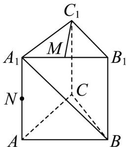
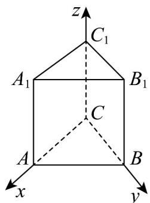
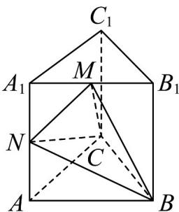

> [!faq]- 《第一章_空间向量与立体几何_高效培优单元测试_强化卷_》官方解析
>
> > [!success]- **【答案】** ABD
>
> > [!note]- **【分析】**
> > 对于选项 $^{A}$ ，要证明线线垂直，需证明线面垂直，即证明 $C_{1}M\perp$ 平面 $ABB_{1}A_{1}$ 即可；对于选项 $^{B}$ ，
> >
> > 首先建立空间直角坐标系，然后将向量 $BA_{1}, CB_{1}$ 的坐标表示出来，利用向量夹角的余弦值公式求出夹角的
> >
> > $$
> > B A _ {1}, C B _ {1}
> > $$
> >
> > 余弦值，进而得到正弦值；对于选项 $C$ ，根据三棱锥的体积公式进行判断即可；对于选项 $D$ ，首先求出底
> >
> > 面外接圆的半径，然后根据勾股定理可求出三棱锥外接球的半径，进而可求出球的表面积·
>
> > [!note]- **【解析】**
> > 对于 A，当 M 为 $A_{1}B_{1}$ 的中点时，有 $C_{1}M \perp A_{1}B$
> >
> > 证明：在直三棱柱 $ABC - A_{1}B_{1}C_{1}$ 中， $BB_{1} \perp$ 平面 $A_{1}B_{1}C_{1}, C_{1}M \subset$ 平面 $A_{1}B_{1}C_{1}, \therefore BB_{1} \perp C_{1}M$
> >
> > $$
> > \because C A = C B, \therefore C _ {1} A _ {1} = C _ {1} B _ {1} \quad \therefore C _ {1} M \perp A _ {1} B _ {1}
> > $$
> >
> > 又∵ $BB_{1} \cap A_{1}B_{1} = B_{1}, BB_{1}, A_{1}B_{1} \subset$ 平面 $ABB_{1}A_{1}$
> >
> > $\therefore C_{1}M \perp ABB_{1}A_{1}, \therefore C_{1}M \perp A_{1}B$ 平面，所以 $^{\mathrm{A}}$ 正确；
> >
> > 
> >
> > 对于 $^{B}$ ，以C为原点，CA为X轴，CB为Y轴， $CC_{1}$ 为Z轴建立空间直角坐标系，
> >
> > 
> >
> > 则 $B(0,1,0), B_1(0,1,2), A_1(1,0,2), C(0,0,0)$ ， $BA_1 = (1,-1,2)$ ， $CB_1 = (0,1,2)$
> >
> > 设 $BA_{1}$ 与 $CB_{1}$ 所成角为 $\alpha$ ，则 $\cos \alpha = \left|\cos \vec{B}BA_{1}, CB_{1}\right| = \frac{\left|\overrightarrow{BA_{1}} \cdot \overrightarrow{CB_{1}}\right|}{\left|\overrightarrow{BA_{1}}\right|\left|\overrightarrow{CB_{1}}\right|} = \frac{\sqrt{30}}{10}$ ，
> >
> > ∴ $\sin\alpha=\sqrt{1-\cos^{2}\alpha}=\frac{\sqrt{70}}{10}$ ，所以 B 正确；
> >
> > 对于 $C$ ， $V_{M - BCN} = V_{C - BMN} = \frac{1}{3} S_{\triangle BMN}\square d$ ，其中 $d$ 为点 $C$ 到平面 $ABB_{1}A_{1}$ 的距离，是一个定值，但 $S_{\triangle BMN}$ 随着点
> >
> > $M$ 的运动而改变，所以 $C$ 错误；
> >
> > 
> >
> > 对于D，因为VABC为等腰直角三角形，所以三棱锥B-ACN的底面外接圆半径 $r = \frac{1}{2} AB = \frac{\sqrt{2}}{2}$
> >
> > $h = AN = 1$ ，所以三棱锥 B - ACN 的外接球半径为 $R = \sqrt{r^{2} + \left(\frac{h}{2}\right)^{2}} = \sqrt{\left(\frac{\sqrt{2}}{2}\right)^{2} + \left(\frac{1}{2}\right)^{2}} = \frac{\sqrt{3}}{2}$
> >
> > 所以 $S_{球} = 4\pi R^{2} = 3\pi$ ，所以 D 正确.
> >
> > 故选 **ABD**.
