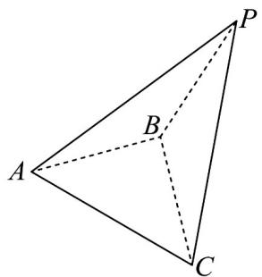

<!-- question-source:start -->
16. 如图，在三棱锥 $P - ABC$ 中， $AB = BC = BP = 2$ ， $AB \perp BC$ ， $\angle PAB = 30^\circ$ ， $\cos \angle ACP = \frac{1}{4}$ .

(1)证明：平面 $PAB \perp$ 平面 $ABC$ ；

(2)求平面 ABC 与平面 ACP 夹角的余弦值.
<!-- question-source:end -->

![[高中/课堂同步/题库/人教A版高中数学同步讲义(2026)/03_选择性必修第一册/第一章 空间向量与立体几何/阶段测试/第一章_空间向量与立体几何_高效培优单元测试_强化卷_/三_填空题_sec_04/questions/answers/Q00062905A1.md]]
